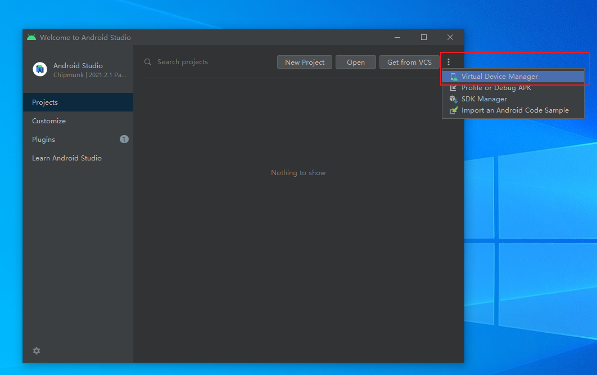
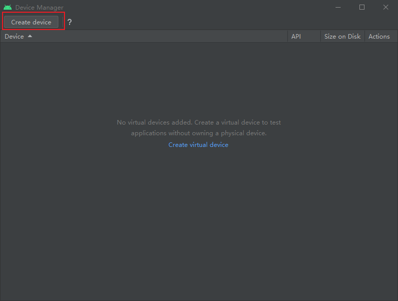
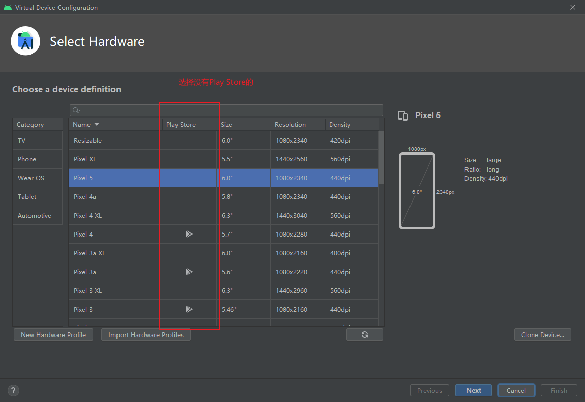
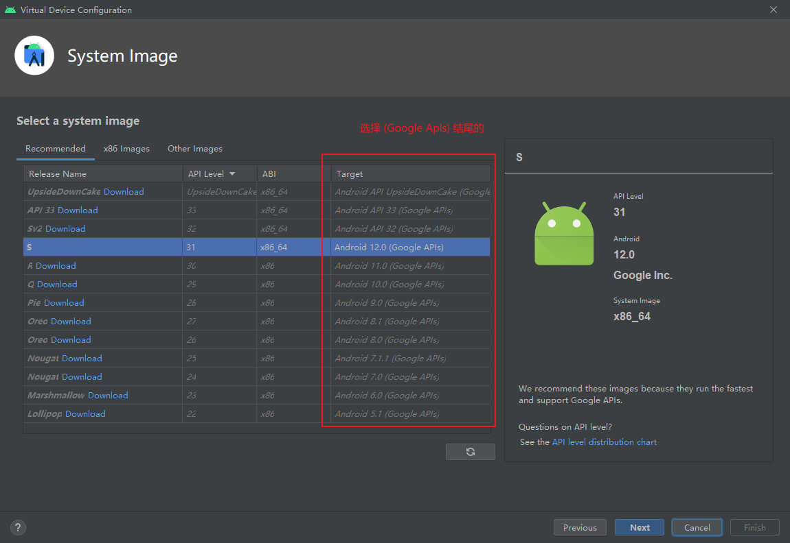
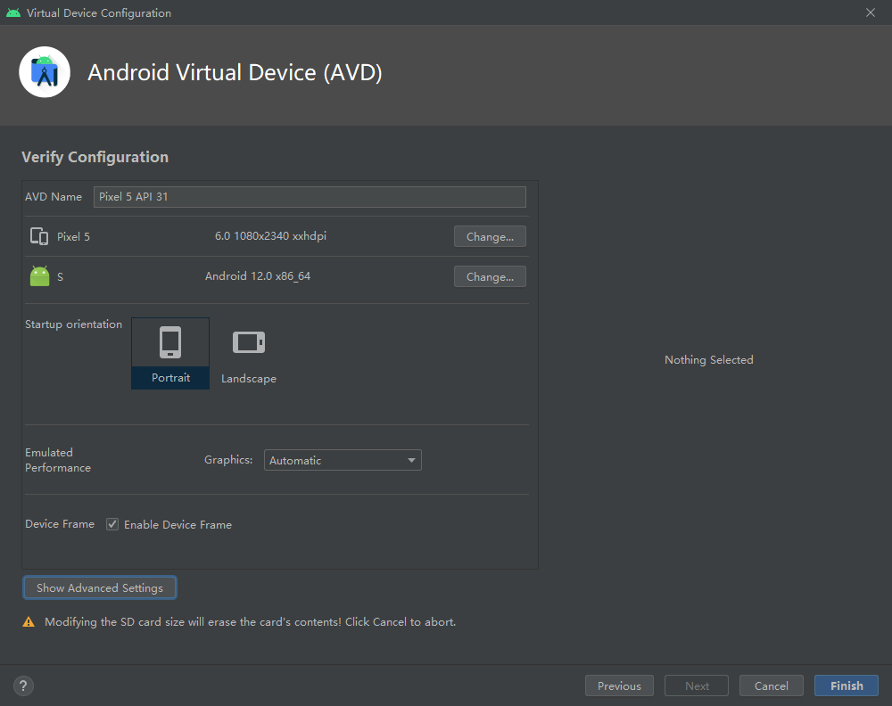

# Android Studio创建具有root权限的虚拟机

本质是创建一个系统镜像Target名称包含`(Google APIs)` 的虚拟机

## 步骤

<figure><figcaption></figcaption></figure>

<figure><figcaption></figcaption></figure>

<figure><figcaption></figcaption></figure>

<figure><figcaption></figcaption></figure>

<figure><figcaption></figcaption></figure>
