# Apple 打包 Golang WebDav 制作 pkg 安装包

## 安装 Packages

*   访问 packages 官网下载安装包并安装

    http://s.sudre.free.fr/Software/Packages/resources.html

    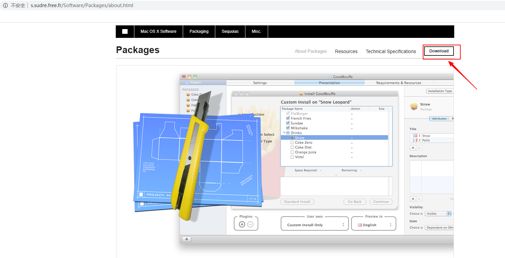
*   下载完成后，运行下载文件，根据提示进行安装

    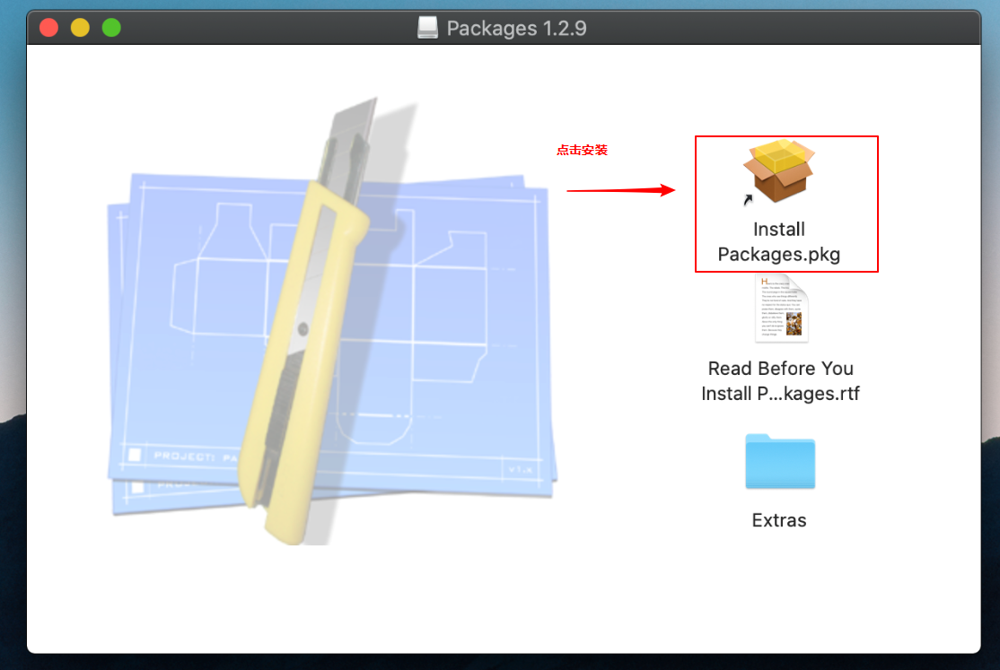

    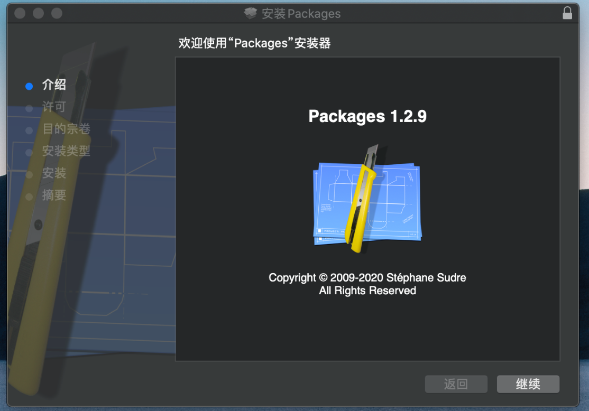

## 准备打包文件

*   webdav

    访问 https://github.com/hacdias/webdav/releases 下载 darwin-amd64-webdav.tar.gz

    获取压缩包里面的 webdav 文件
*   config.yaml

    ```properties
    # Server related settings
    address: 0.0.0.0
    port: 8888
    auth: true
    tls: false
    cert: cert.pem
    key: key.pem
    prefix: /

    users:
      - username: admin
        password: admin
        modify: true
        scope: /Library/Zhxlp/WebDav/data
    ```
*   com.zhxlp.webdav.plist

    ```properties
    <?xml version="1.0" encoding="UTF-8"?>
    <!DOCTYPE plist PUBLIC "-//Apple Computer//DTD PLIST 1.0//EN"
            "http://www.apple.com/DTDs/PropertyList-1.0.dtd">
    <plist version="1.0">
    <dict>
            <!-- Label唯一的标识 -->
            <key>Label</key>
            <string>com.zhxlp.webdav</string>
            <!-- 指定要运行的脚本 -->
            <key>ProgramArguments</key>
            <array>
                    <string>/Library/Zhxlp/WebDav/webdav</string>
                    <string>-c</string>
                    <string>/Library/Zhxlp/WebDav/config.yaml</string>
            </array>
            <!-- 开机时是否运行 -->
            <key>RunAtLoad</key>
            <true/>
            <!-- 程序是否需要一直运行 -->
            <key>KeepAlive</key>
            <true/>
            <!--
            工作目录
            <key>WorkingDirectory</key>
            <string>/Library/Zhxlp/WebDav/</string>
            调试模式
            <key>Debug</key>
            <true/>
            标准输出日志
            <key>StandardOutPath</key>
            <string>/tmp/com.zhxlp.webdav.log</string>
            错误输出日志
            <key>StandardErrorPath</key>
            <string>/tmp/com.zhxlp.webdav.log</string>
            -->
    </dict>
    </plist>
    ```
*   pre-installation.sh

    ```bash
    #!/usr/bin/env bash

    echo "Running pre script"

    if [[ -f "/Library/LaunchDaemons/com.zhxlp.webdav.plist" ]];then
        launchctl unload /Library/LaunchDaemons/com.zhxlp.webdav.plist
    fi
    exit 0
    ```
*   post-installation.sh

    ```bash
    #!/usr/bin/env bash

    echo "Running post script"

    if [[ -f "/Library/Zhxlp/WebDav/webdav" && -f "/Library/LaunchDaemons/com.zhxlp.webdav.plist" ]];then
        launchctl load /Library/LaunchDaemons/com.zhxlp.webdav.plist
    fi

    exit 0
    ```

## 创建打包工程

*   在 Application 中打开 Packages，选择 `Distribution`,点击 Next

    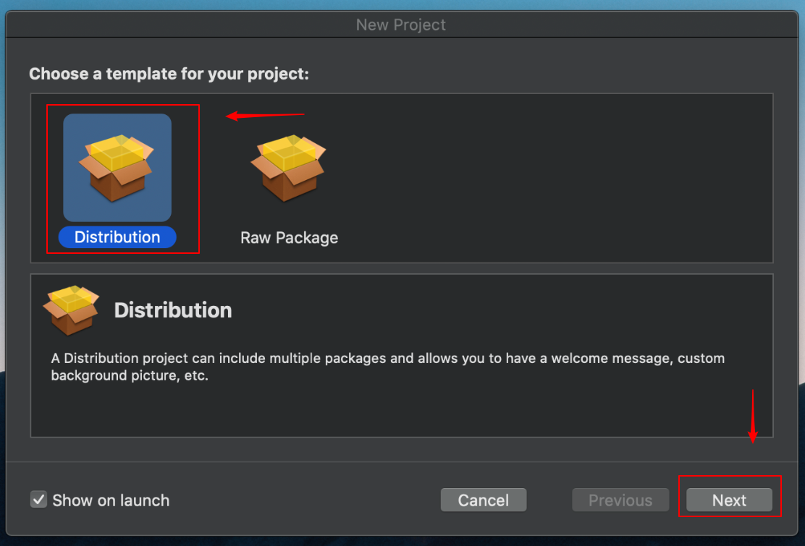
*   设置工程名称和项目存储目录，点击 Create 创建

    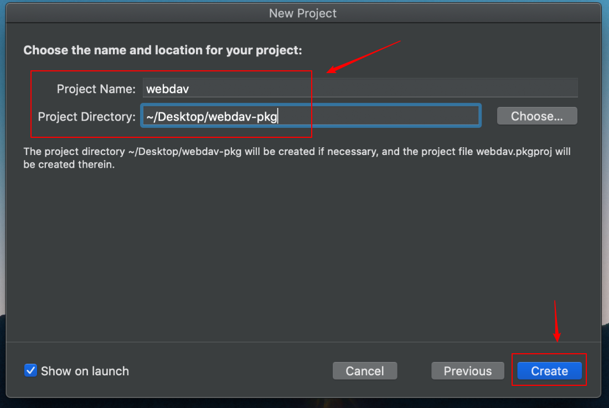
*   配置项目

    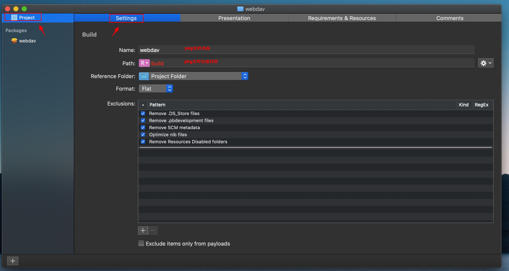

    配置安装方式选择 仅标准安装

    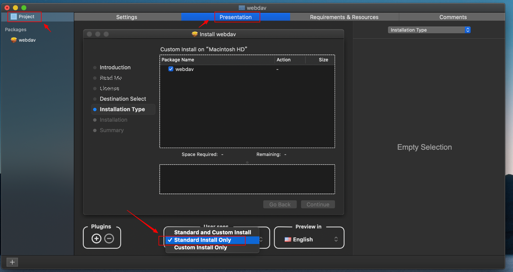

    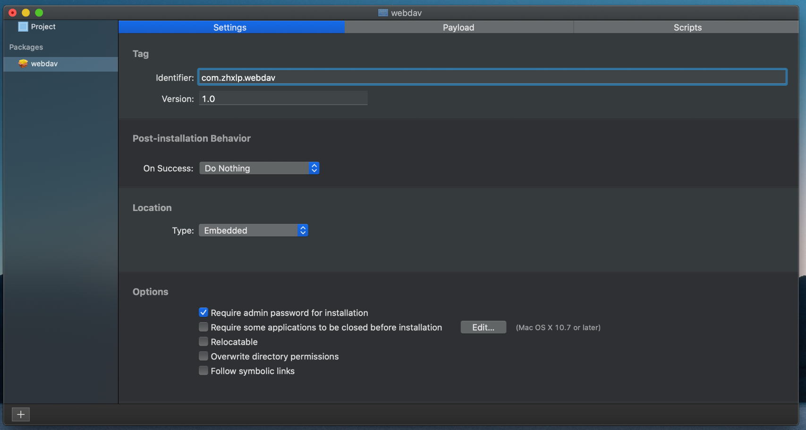

    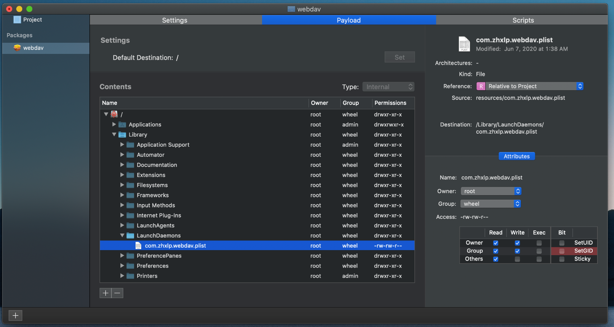

    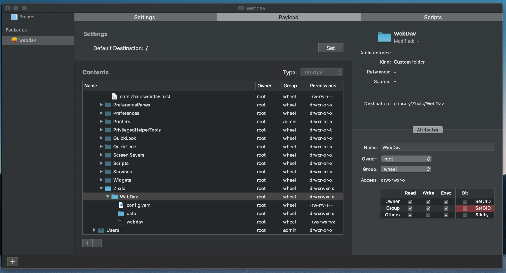

    配置安装前和安装后运行脚本

    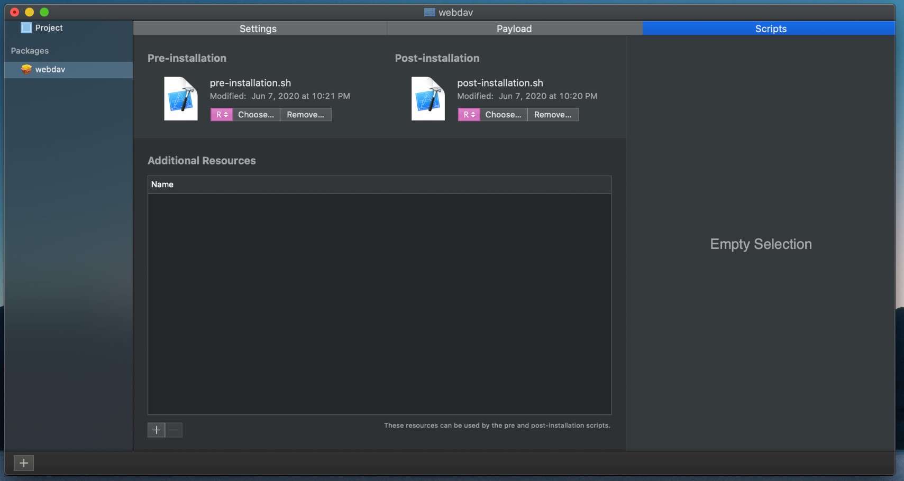

    保存

    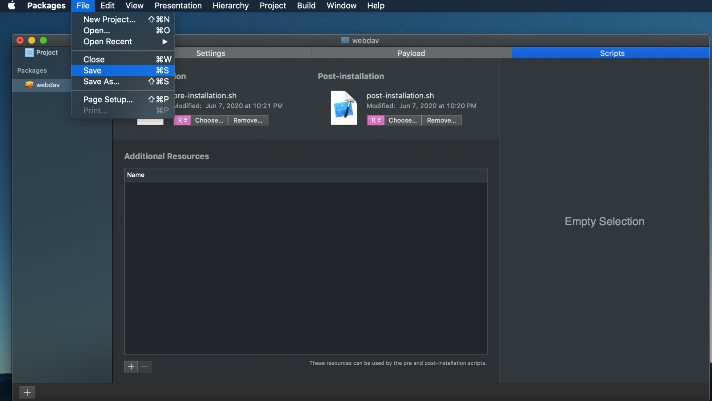

    Build

    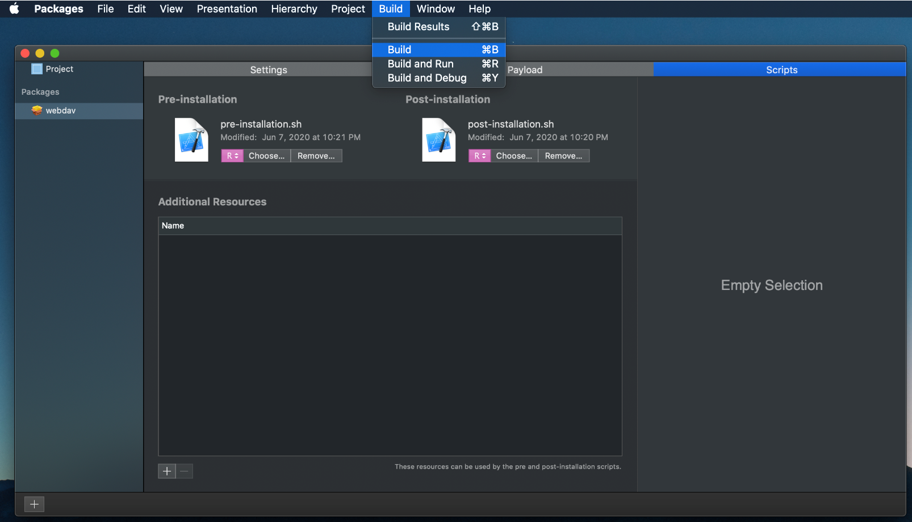

    文件生成在项目目录的 build 文件夹中 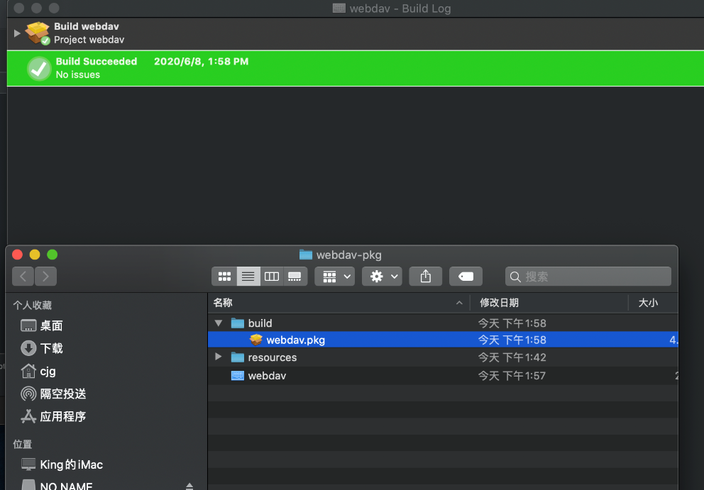

## 签名

需要为您分发的所有可执行文件启用代码签名，并确保可执行文件具有有效的代码签名

需要为你需要公正的 pkg 包进行安装签名，并确保 pkg 文件具有有效的代码签名

代码签名需要使用 "Developer ID Application"证书，pkg 签名需要使用"Developer ID Installer"证书，请访问https://developer.apple.com/account/resources/certificates/ 进行创建

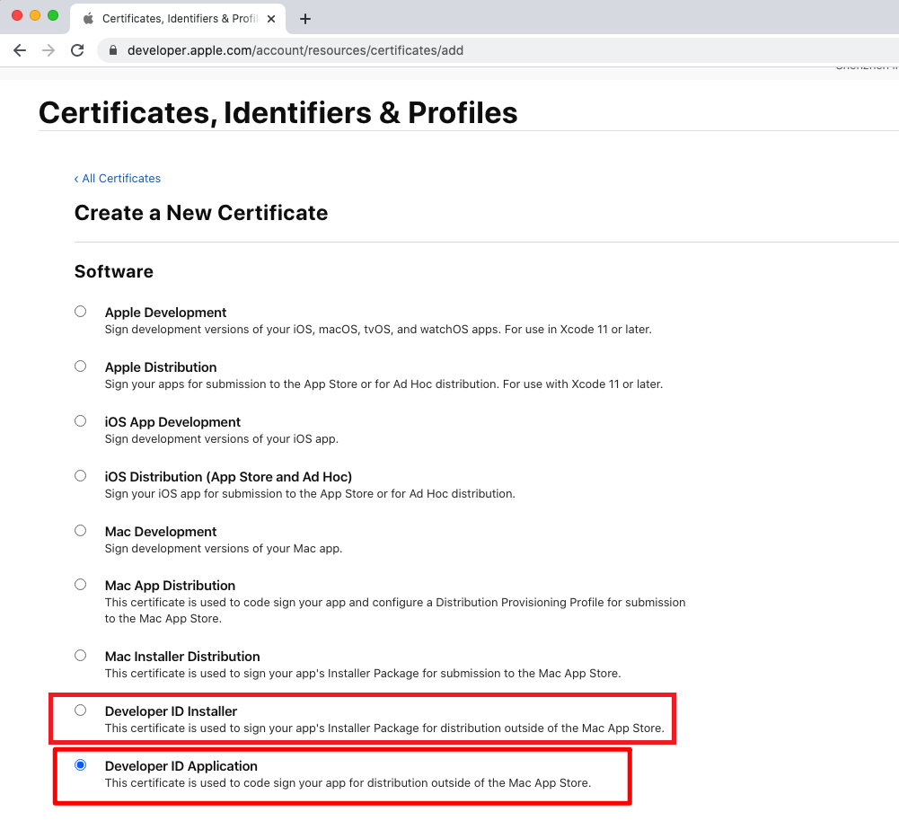

*   查看可用于签名的证书

    ```bash
    security find-identity -v -p codesigning
    ```

    
*   签名可执行文件

    \-s 指定签名证书，使用上方查询到的证书

    ```bash
    codesign -f -o runtime --timestamp --deep -s "Developer ID Application: xxxxxxxxxxxxxxxxx" -i "com.zhxlp.webdav" resources/webdav
    ```
*   查看文件签名

    ```bash
    codesign -dvv resources/webdav
    ```

    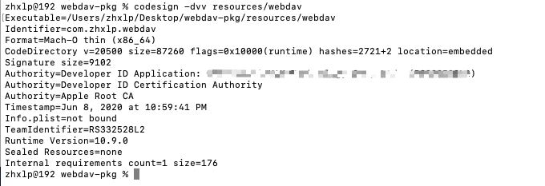
* 重新打包 pkg
*   查看可用"Developer ID Installer"证书

    ```
    security find-identity -v | grep "Developer ID Installer"
    ```
*   签名 pkg

    ```bash
    productsign --sign "Developer ID Installer: xxxxxxxxxxxxx" build/webdav.pkg build/webdav-sign.pkg
    ```
*   查看 pkg 签名

    ```bash
    pkgutil --check-signature build/webdav-sign.pkg
    ```

    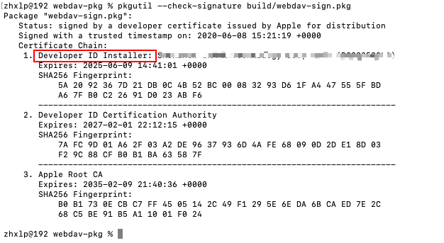

## 公正

公正需要使用到开发者账号的用户名和密码,密码不是真实密码，而是 App 专用密码，访问 https://appleid.apple.com/ 获取

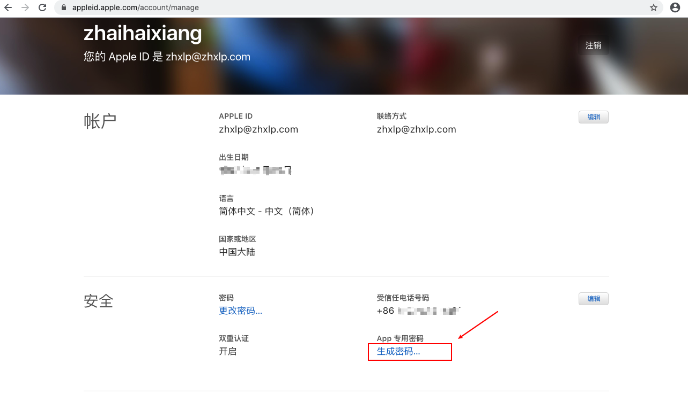

*   查询 ProviderShortname

    ```bash
    xcrun altool --list-providers -u "zhxlp@zhxlp.com" -p "xxxx-xxxx-xxxx-xxxx"
    ```

    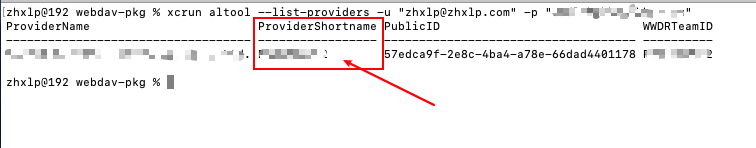
*   公正

    \--asc-provider 使用上方查询的 ProviderShortname

    ```bash
    xcrun altool --notarize-app --primary-bundle-id "com.zhxlp.webdav" \
    --username "zhxlp@zhxlp.com" --password "xxxx-xxxx-xxxx-xxxx" \
    --asc-provider "xxxxx" -t osx --file build/webdav-sign.pkg
    ```

    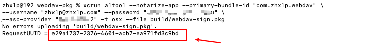
*   查询公正结果

    \--notarization-info 后面添加上次返回的 RequestUUID

    ```bash
    xcrun altool --notarization-info "e29a1737-2376-4601-acb7-ea971fd3c9bd" \
    --username "zhxlp@zhxlp.com" --password "xxxx-xxxx-xxxx-xxxx"
    ```

    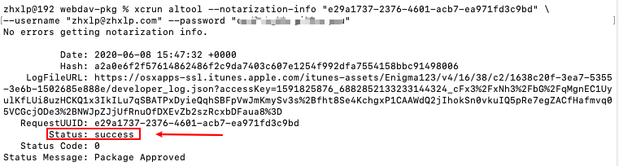

    **公正结果一定要为 success 后再进行下一步操作，如遇见错误可以访问 LogFileURL 查看原因**
*   添加票证到 pkg 文件

    公证会生成一张票证，告知 Gatekeeper 您的应用程序已公证。公证成功完成后，下一次任何用户尝试在 macOS 10.14 或更高版本上运行您的应用程序时，Gatekeeper 都会在线找到该票证。其中包括在经过公证之前下载了您的应用的用户。

    您还应该使用该`stapler`工具将票证附加到软件上，以便将来的发行版中包括票证。这样可以确保即使网络连接不可用，网闸也可以找到故障单。要将票证附加到您的应用程序，捆绑软件，磁盘映像或固定安装程序包，请使用以下`stapler`工具：

    ```bash
    xcrun stapler staple build/webdav-sign.pkg
    ```

    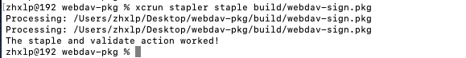
*   查看票证是否添加成功

    返回 `The validate action worked!`表示成功

    ```bash
    xcrun stapler validate build/webdav-sign.pkg
    ```

    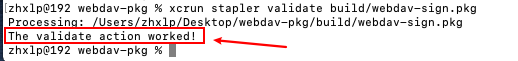

## 参考

[发行前对 Mac OS 软件进行公证](https://developer.apple.com/documentation/xcode/notarizing\_macos\_software\_before\_distribution)

[自定义公证工作流程](https://developer.apple.com/documentation/xcode/notarizing\_macos\_software\_before\_distribution/customizing\_the\_notarization\_workflow)

[解决常见的公证问题](https://developer.apple.com/documentation/xcode/notarizing\_macos\_software\_before\_distribution/resolving\_common\_notarization\_issues)

[创建启动守护程序和代理](https://developer.apple.com/library/archive/documentation/MacOSX/Conceptual/BPSystemStartup/Chapters/CreatingLaunchdJobs.html)
