# AppStore 应用开发及上架

## 创建证书签名请求

1.  启动位于 `/Applications/Utilities` 中的“钥匙串访问”。

    
2.  选取“钥匙串访问”>“证书助理”>“从证书颁发机构请求证书”。

    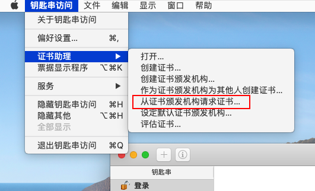
3. 在“证书助理”对话框中，在“用户电子邮件地址”栏位中输入电子邮件地址。
4. 在“常用名称”栏位中，输入密钥的名称 (例如，Gita Kumar Dev Key)。
5. 将“CA 电子邮件地址”栏位留空。
6. 选取“存储到磁盘”，然后点按“继续”。

## 创建开发证书

1. 在“[Certificates, Identifiers & Profiles (英文)](https://developer.apple.com/account/resources)”(证书、标识符和描述文件) 中，从侧边栏中选择“Certificates”(证书)。
2.  在右上角，点按添加按钮 (+)。

    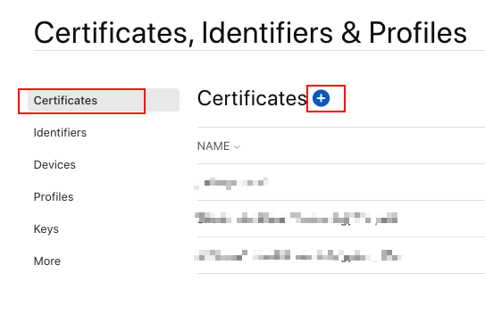
3.  在“Software”(软件) 下面，选择“Apple Development”，然后点按“Continue”(继续)。

    
4.  点按“Choose File”(选取文件)。

    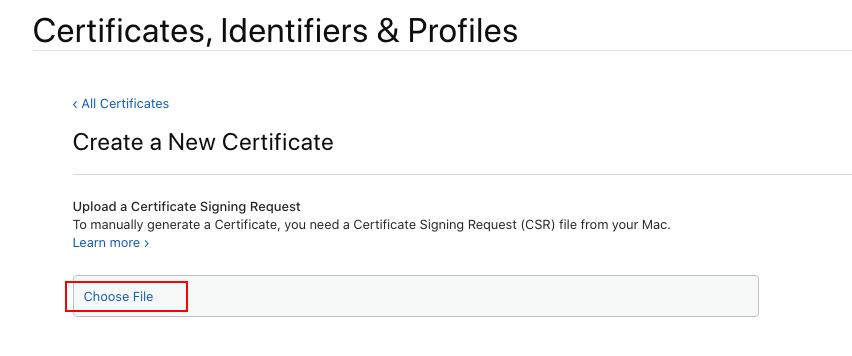
5.  在出现的对话框中，选择证书请求文件 (创建证书签名请求中生成的文件)，然后点按“Choose”(打开)。

    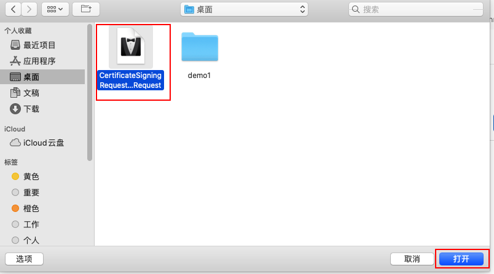
6.  点按“Continue”(继续)。

    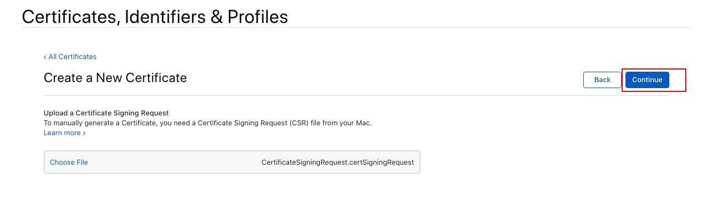
7.  点按“Download”(下载)。

    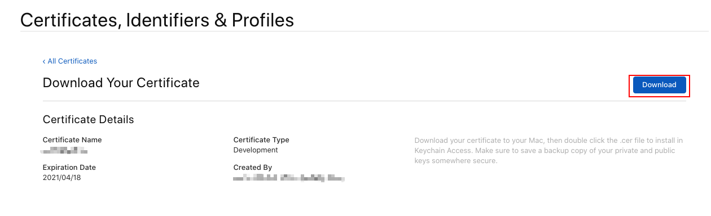
8.  双击已下载的证书文件，在添加证书界面中，“钥匙串”选择“登录”，再点击“添加”

    
9.  证书可在“钥匙串访问”工具中查看

    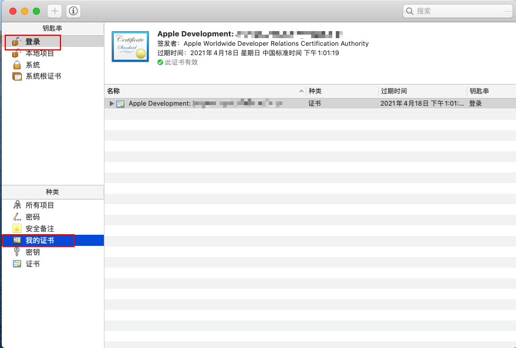

## 创建分发证书

1. 在“[Certificates, Identifiers & Profiles (英文)](https://developer.apple.com/account/resources)”(证书、标识符和描述文件) 中，从侧边栏中选择“Certificates”(证书)。
2.  在右上角，点按添加按钮 (+)。

    
3.  在“Software”(软件) 下面，选择“Apple Distribution”，然后点按“Continue”(继续)。

    
4.  点按“Choose File”(选取文件)。

    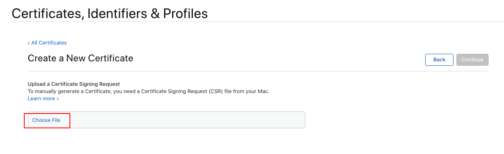
5.  在出现的对话框中，选择证书请求文件 (创建证书签名请求中生成的文件)，然后点按“Choose”(打开)。

    
6.  点按“Continue”(继续)。

    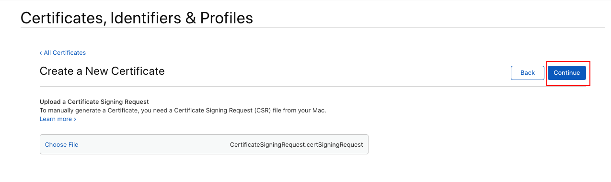
7.  点按“Download”(下载)。

    
8.  双击已下载的证书文件，在添加证书界面中，“钥匙串”选择“登录”，再点击“添加”

    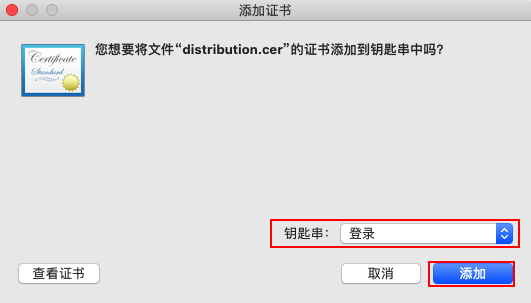
9.  证书可在“钥匙串访问”工具中查看

    

## 注册 App ID

1.  在“[Certificates, Identifiers & Profiles (英文)](https://developer.apple.com/account/resources)”(证书、标识符和描述文件) 中，从侧边栏中选择“Identifiers”(标识符)，然后点按左上角的添加按钮 (+)。

    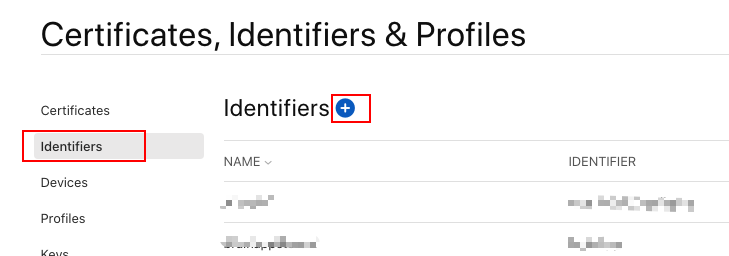
2.  从选项列表中选择“App IDs”(App ID)，然后点按“Continue”(继续)。

    
3. 在“Description”(描述) 栏位中输入 App ID 的名称或描述。
4.  在 Bundle ID 处选择“Explicit”并在输入框中 输入 app 的 Bundle ID。

    您在这里输入的 App ID 应该与 Xcode 中目标的“Summary”(摘要) 面板中输入的 Bundle ID 一致。
5.  选中相应的复选框，以启用您想要使用的 app 功能。

    “Capabilities”(功能) 下面会显示您的 app 类型和计划会员资格可以使用的功能。如果某个技术需要精确 App ID，而您创建的是通配符 App ID，或者该技术默认处于启用状态，则对应复选框会处于停用状态。并非所有功能都适用于所有平台。

    
6.  点按“Continue”(继续)，检查注册信息，然后点按“Register”(注册)。

    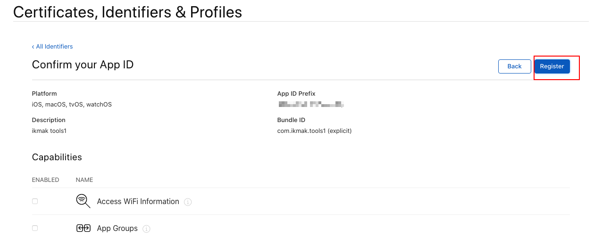

    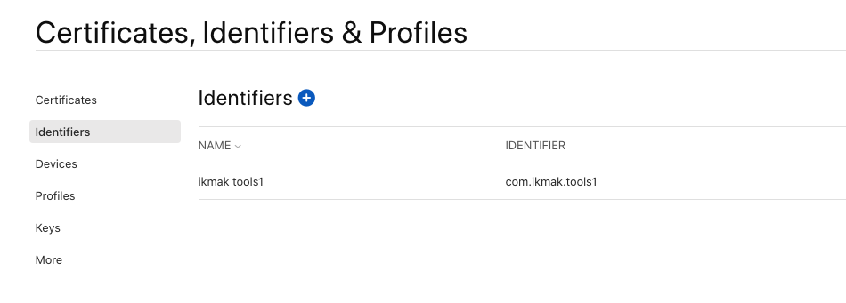

## 创建 App Store 预置描述文件

您可以创建自己的 App Store 预置描述文件，在将 app 上传到 App Store Connect 时使用。

1.  在“[Certificates, Identifiers & Profiles (英文)](https://developer.apple.com/account/resources)”(证书、标识符和描述文件) 中，从侧边栏中选择“Profiles”(描述文件)，然后点按左上角的添加按钮 (+)。

    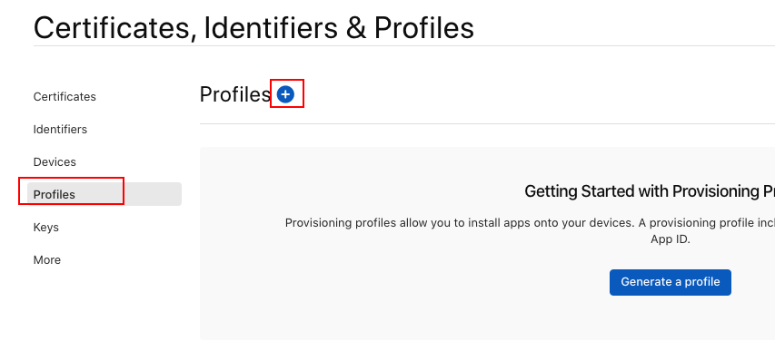
2.  在“Distribution”(分发) 下面，选择“App Store” ，然后点按“Continue”(继续)。

    s
3.  从“App ID”弹出式菜单中选取用于开发的 App ID (与您的套装 ID 相匹配的 App ID)，然后点按“Continue”(继续)。

    
4.  选择您的分发证书，然后点按“Continue”(继续)。

    
5.  输入描述文件名称，然后点按“Generate”(生成)。

    
6.  点按“Download”(下载)。

    

## 创建 App 应用程序

1.  打开“xcode”开发工具，点击“Create a new Xode Project”创建一个新应用

    
2.  在 Application 下选择“Single View App”,点击“Next”继续

    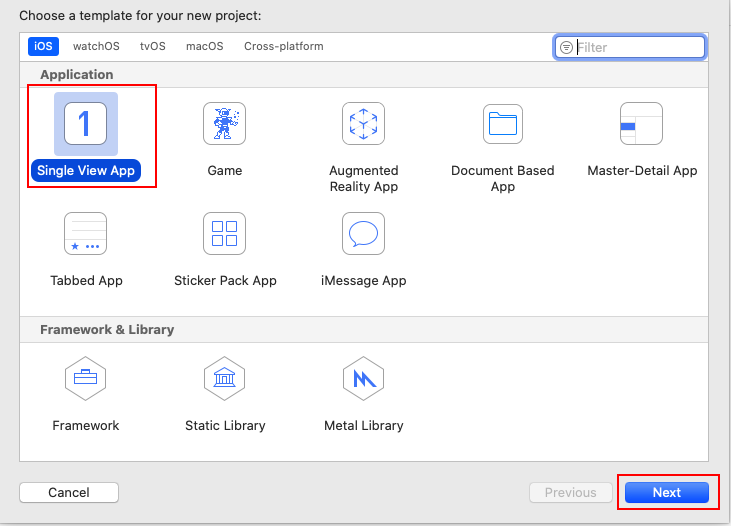
3.  输入信息，点击“Next”继续

    
4.  选择应用保存路径，点击“Create”创建应用

    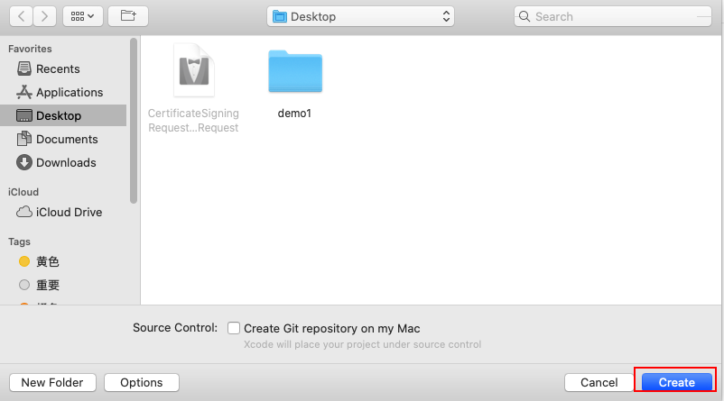
5.  编辑代码，编写随机数工具

    
6.  修改 Bundle ID，与注册 App ID 时一致

    
7.  配置签名，取消“Automatically manage signing”，选择“Provisioning Profile”点击导入，选择“创建 App Store 预置描述文件”下载的文件

    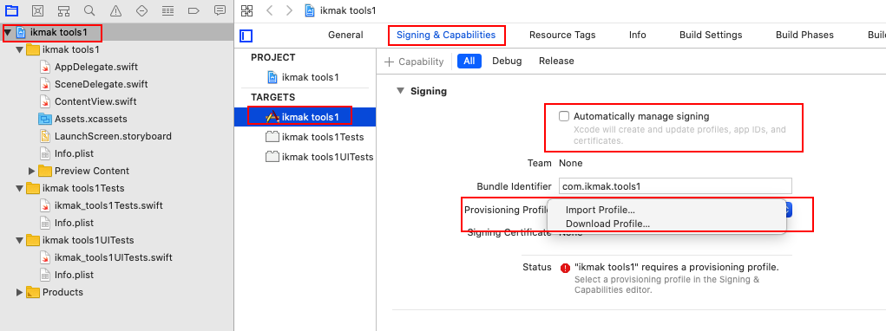

    
8.  配置图标

    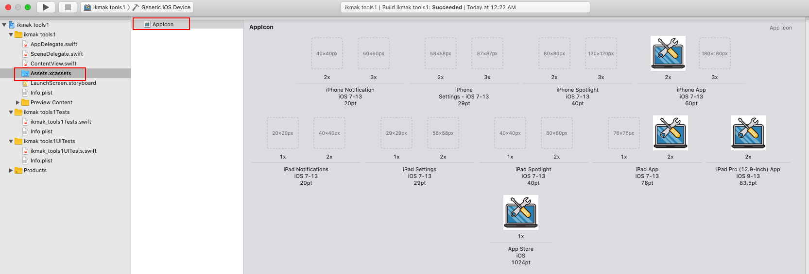

## 添加 App 至您的帐户

您必须先在 App Store Connect 帐户中创建一个 App 记录，然后才能将 App 的构建版本上传至 App Store Connect。

1.  登录[App Store Connect](https://appstoreconnect.apple.com/)，点按“我的 App”。

    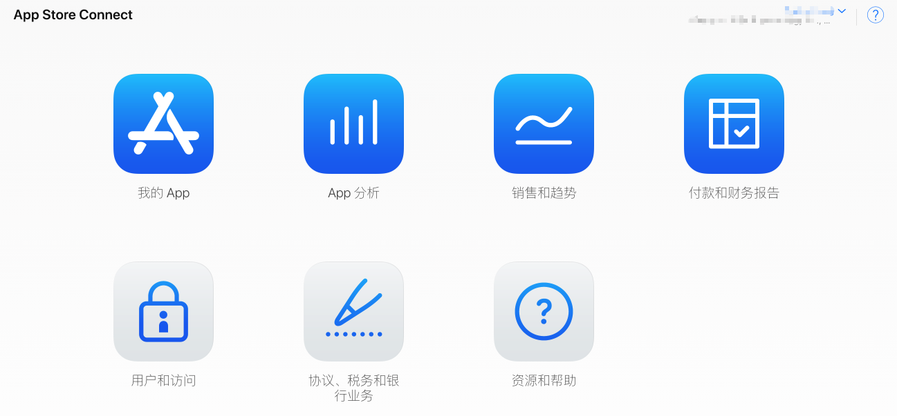
2.  在左上角，点按“添加”按钮（+）,请从弹出菜单中选择“新建 App”

    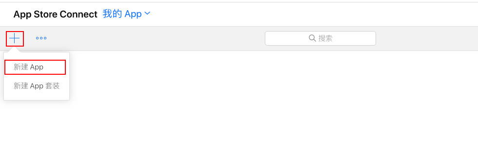
3.  在“新建 App”对话框中，选择一个或多个平台，并输入 App 信息,点击创建

    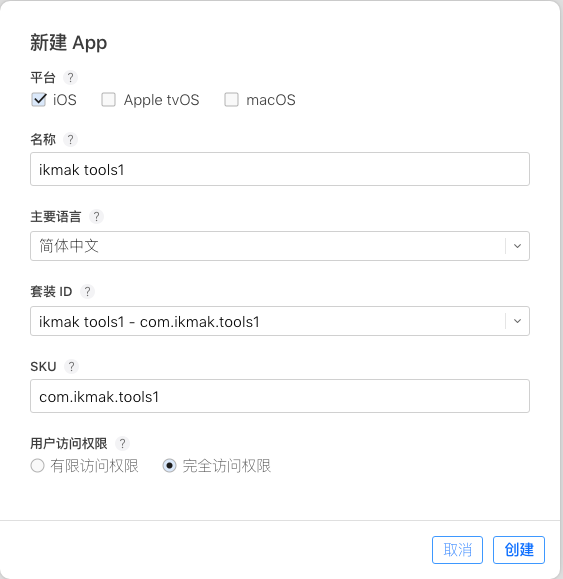
4.  配置 App 信息，点击存储

    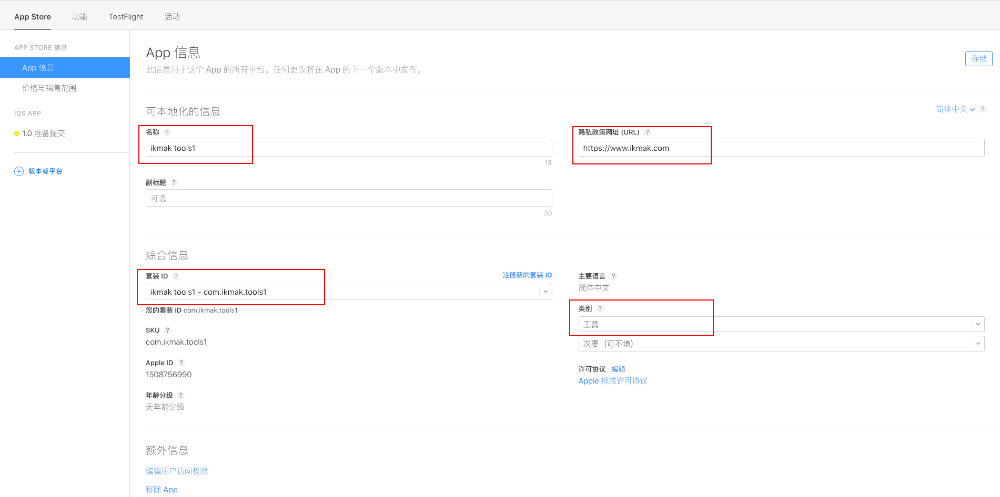
5.  配置价格和销售范围,点击存储

    
6.  配置版本信息，点击存储

    

    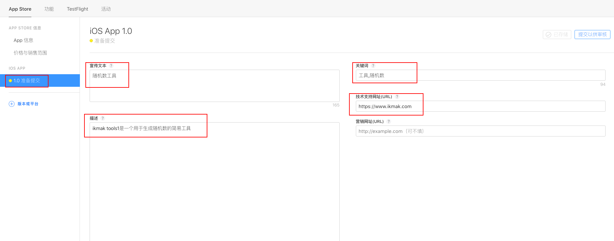

    

## 上传构建版本

1.  选择“Generic iOS Device”构建

    
2.  点击“Product”->“Archive”

    
3.  发布应用程序

    点击“Distribute App”

    

    选择“App Store Connect”，点击“Next”

    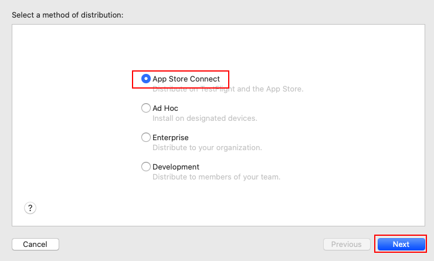

    选择“Upload”，点击“Next”

    

    如果无法连接 “App Store Connect”，请点击“Manage Accounts”登录 Apple ID

    

    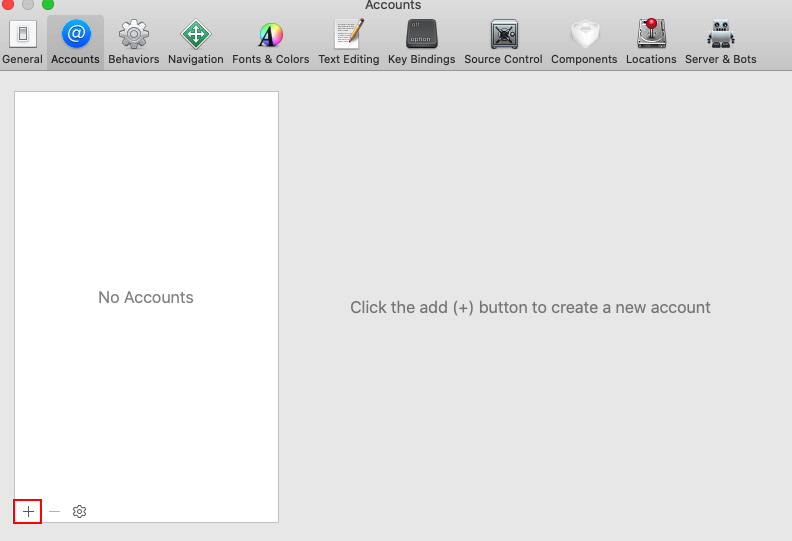

    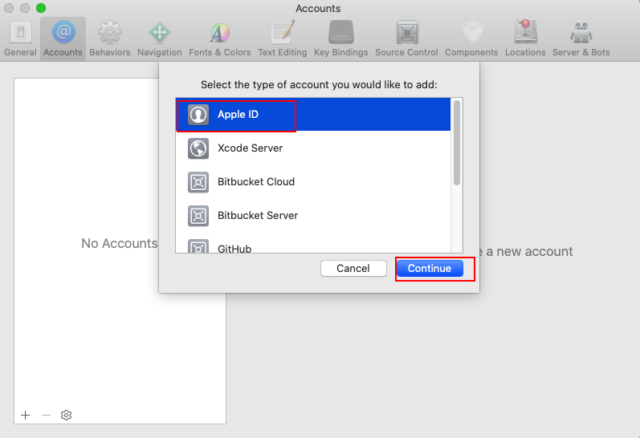

    如果能连接“App Store Connect ”，点击“Next”

    

    选择“发放证书”和“App Store”预置描述文件，点击“Next”

    

    点击“Upload”

    

    上传成功，点击 Done

    

## 提交审核

1. 选择构建版本,点击存储

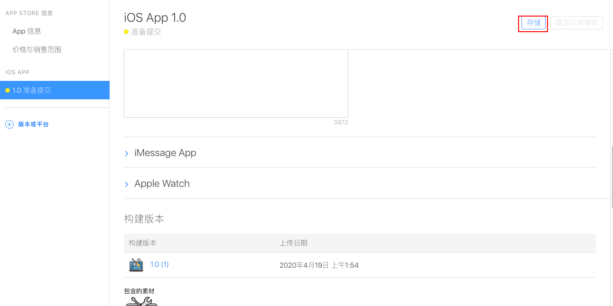

1.  提交以供审核

    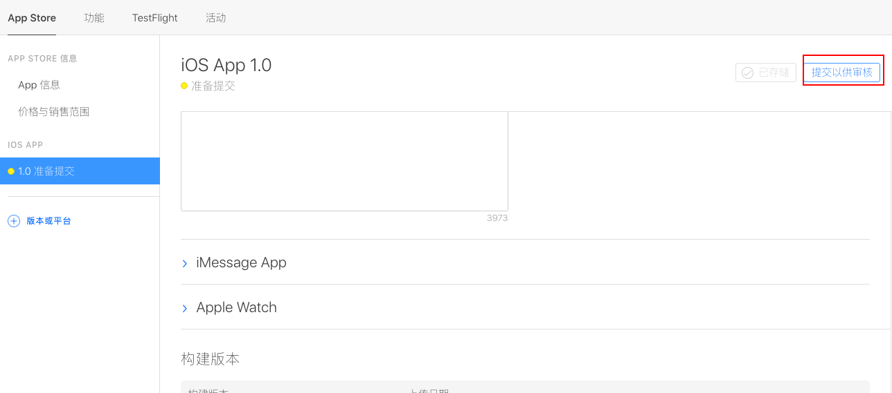

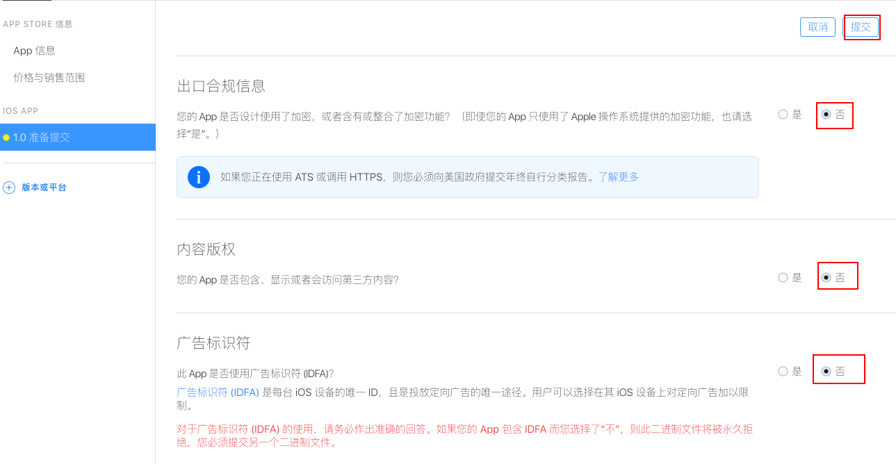
