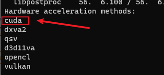
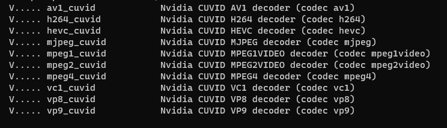
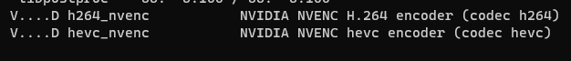

# 使用NVIDIA显卡

## 查看FFmpeg 是否支持cuda

```bash
ffmpeg -hwaccels
```

<figure><figcaption></figcaption></figure>

## 安装CUDA

访问 [https://developer.nvidia.com/cuda-downloads](https://developer.nvidia.com/cuda-downloads)下载安装

## 查看FFmpeg 解码/编码器

### 解码器

```bash
ffmpeg -decoders | find  /I "nvidia"
```

<figure><figcaption></figcaption></figure>

### 编码器

```bash
ffmpeg -encoders | find  /I "nvidia"
```

<figure><figcaption></figcaption></figure>

## 示例

### 将mp4转为m3u8

```
ffmpeg -hwaccel cuda -c:v h264_cuvid \
  -i test.mp4 -forced-idr 1 \
  -force_key_frames "expr:gte(t,n_forced*2)" \
  -strict -2 -c:a aac \
  -c:v h264_nvenc -f hls -hls_list_size 0 \
  -hls_time 2 .\m3u8\index.m3u8 \

```

`-hwaccel cuda`  指定使用`nvidia`硬件

`-c:v h264_cuvid` 指定使用 `nvidia` 解码器

`-c:v h264_nvenc` 指定使用 `nvidia` 编码器


