# Fabric 集群部署

## 准备

*   文件说明

    **chaincode**：链码文件夹,存放链码

    **crypto-config.yaml**：生成组织关系和身份证书配置文件

    **configtx.yaml**：生成通道创世块或通道交易的配置文件

    **docker-compose-zookeeper\*.yaml**：zookeeper 容器配置文件

    **docker-compose-kafka\*.yaml**：kafka 容器配置文件

    **docker-compose-orderer\*.yaml**：orderer 容器配置文件

    **docker-compose-org\*-peer\*.yaml**：peer 容器配置文件
*   拷贝文件到相应节点

    \[192.168.5.31]

    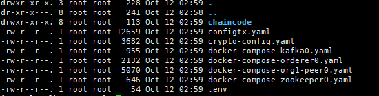

    \[192.168.5.32]

    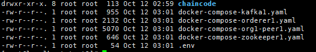

    \[192.168.5.33]

    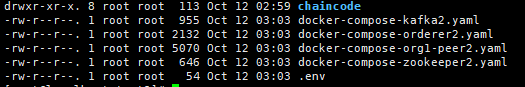
*   生成组织关系和身份证书

    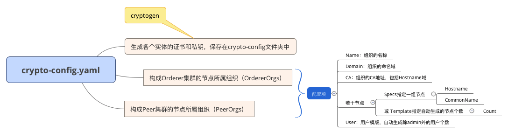

    ```bash
    cryptogen generate --config=./crypto-config.yaml
    ```

    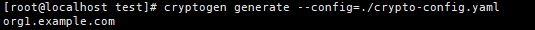
*   配置`configtxgen`工具工作目录,目录中要存在`configtx.yaml`文件

    ```bash
    export FABRIC_CFG_PATH=$PWD
    mkdir channel-artifacts
    ```
*   生成创世区块

    ```bash
    configtxgen -profile TwoOrgsOrdererGenesis -channelID byfn-sys-channel -outputBlock ./channel-artifacts/genesis.block
    ```

    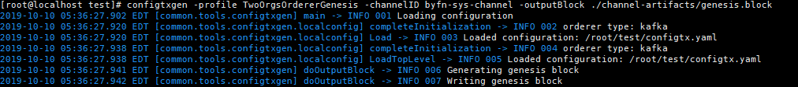
*   生成通道配置文件

    ```bash
    configtxgen -profile TwoOrgsChannel -outputCreateChannelTx ./channel-artifacts/mychannel.tx -channelID mychannel
    ```

    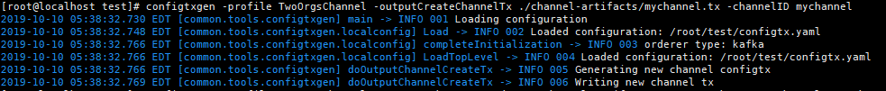
*   生成锚节点配置文件

    ```bash
    # Org1
    configtxgen -profile TwoOrgsChannel -outputAnchorPeersUpdate ./channel-artifacts/Org1MSPanchors.tx -channelID mychannel -asOrg Org1MSP
    ```

    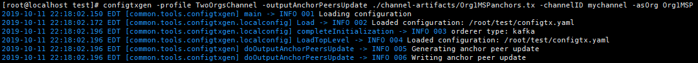
*   拷贝`crypto-config`目录和`channel-artifacts`目录到其它机器

    **crypto-config**：存放生成的组织关系和身份证书

    **channel-artifacts**：存放创世区块和通道配置
*   启动`zookeeper`服务

    \[192.168.5.31]

    ```bash
    docker-compose -f docker-compose-zookeeper0.yaml up -d
    ```

    \[192.168.5.32]

    ```bash
    docker-compose -f docker-compose-zookeeper1.yaml up -d
    ```

    \[192.168.5.33]

    ```bash
    docker-compose -f docker-compose-zookeeper2.yaml up -d
    ```
*   检查 zookeeper 集群状态

    \[192.168.5.31]

    ```bash
    docker exec -it zookeeper0 zkServer.sh status
    ```

    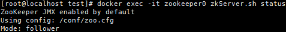

    \[192.168.5.32]

    ```bash
    docker exec -it zookeeper1 zkServer.sh status
    ```

    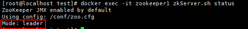

    \[192.168.5.33]

    ```bash
    docker exec -it zookeeper2 zkServer.sh status
    ```

    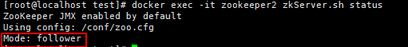
*   启动 kafka 服务

    \[192.168.5.31]

    ```bash
    docker-compose -f docker-compose-kafka0.yaml up -d
    ```

    \[192.168.5.32]

    ```bash
    docker-compose -f docker-compose-kafka1.yaml up -d
    ```

    \[192.168.5.33]

    ```bash
    docker-compose -f docker-compose-kafka2.yaml up -d
    ```
*   查看日志检查 kafka 服务

    \[192.168.5.31]

    ```bash
    docker logs kafka0
    ```

    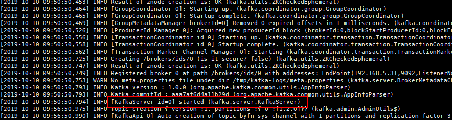

    \[192.168.5.32]

    ```bash
    docker logs kafka1
    ```

    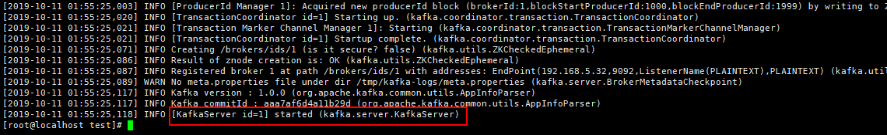

    \[192.168.5.33]

    ```bash
    docker logs kafka2
    ```

    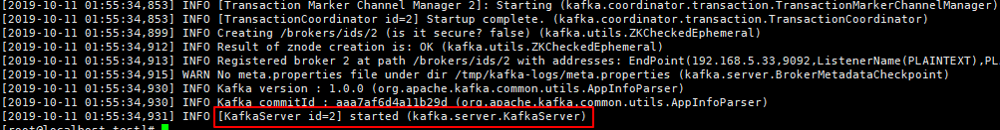
*   启动 orderer 服务

    \[192.168.5.31]

    ```bash
    docker-compose -f docker-compose-orderer0.yaml up -d
    ```

    \[192.168.5.32]

    ```bash
    docker-compose -f docker-compose-orderer1.yaml up -d
    ```

    \[192.168.5.33]

    ```bash
    docker-compose -f docker-compose-orderer2.yaml up -d
    ```
*   查看日志检查 orderer 服务

    \[192.168.5.31]

    ```bash
    docker logs orderer0.example.com
    ```

    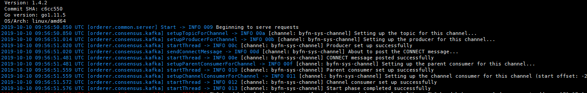

    \[192.168.5.32]

    ```bash
    docker logs orderer1.example.com
    ```

    

    \[192.168.5.33]

    ```bash
    docker logs orderer2.example.com
    ```

    
*   启动 peer 服务

    \[192.168.5.31]

    ```bash
    docker-compose -f docker-compose-org1-peer0.yaml up -d
    ```

    \[192.168.5.32]

    ```bash
    docker-compose -f docker-compose-org1-peer1.yaml up -d
    ```

    \[192.168.5.33]

    ```bash
    docker-compose -f docker-compose-org1-peer2.yaml up -d
    ```
*   查看 peer 日志

    \[192.168.5.31]

    ```bash
    docker logs peer0.org1.example.com
    ```

    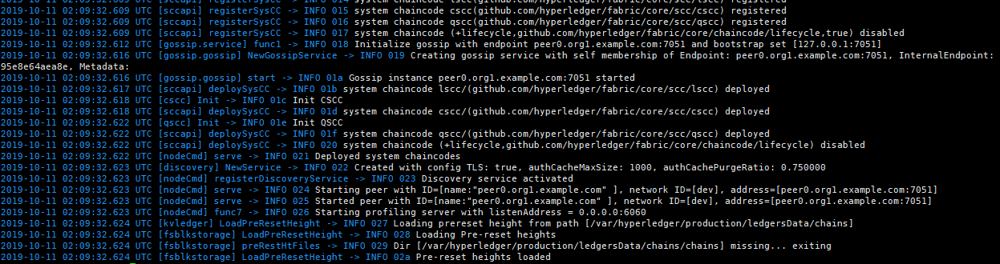

    \[192.168.5.32]

    ```bash
    docker logs peer1.org1.example.com
    ```

    

    \[192.168.5.33]

    ```bash
    docker logs peer2.org1.example.com
    ```

    
*   登录 cli 终端

    \[all]

    ```bash
    docker exec -it cli bash
    ```
*   配置 orderer 证书和通道环境变量

    \[all]

    ```bash
    export ORDERER_CA=/opt/gopath/src/github.com/hyperledger/fabric/peer/crypto/ordererOrganizations/example.com/orderers/orderer0.example.com/msp/tlscacerts/tlsca.example.com-cert.pem
    export CHANNEL_NAME=mychannel
    ```
*   创建通道

    \[192.168.5.31]

    ```bash
    peer channel create -o orderer0.example.com:7050 -c $CHANNEL_NAME -f ./channel-artifacts/mychannel.tx --tls --cafile $ORDERER_CA
    mv mychannel.block channel-artifacts/
    ```

    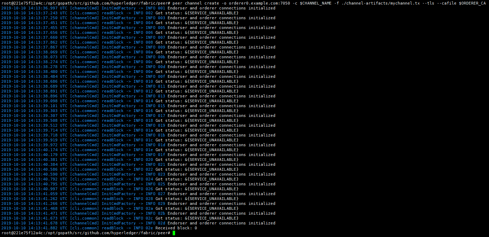
* 拷贝`channel-artifacts/mychannel.block`文件到其它节点的相同目录
*   加入通道

    \[all]

    ```bash
    peer channel join -b channel-artifacts/mychannel.block
    ```

    
*   更新锚点

    \[192.168.5.31]

    ```bash
    peer channel update -o orderer0.example.com:7050 -c $CHANNEL_NAME -f ./channel-artifacts/Org1MSPanchors.tx --tls true --cafile $ORDERER_CA
    ```

    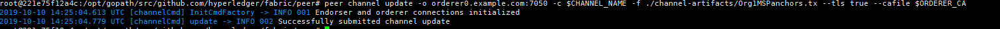
*   安装链码

    \[all]

    ```bash
    peer chaincode install -n sacc -v 1.0 -l golang -p github.com/chaincode/sacc/
    ```

    
*   初始化链码

    \[192.168.5.31]

    ```bash
    peer chaincode instantiate -o orderer0.example.com:7050 --tls true --cafile $ORDERER_CA -C $CHANNEL_NAME -n sacc -l golang -v 1.0 -c '{"Args":["a","123456"]}'
    ```

    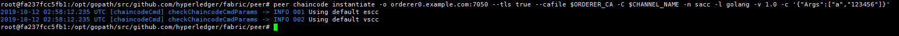
*   查询数据

    ```bash
    peer chaincode query -C $CHANNEL_NAME -n sacc -c '{"Args":["get","a"]}'
    ```

    
*   修改数据

    ```bash
    peer chaincode invoke -o orderer0.example.com:7050 --tls true --cafile $ORDERER_CA -C $CHANNEL_NAME -n sacc -c '{"Args":["set","a","abcdef"]}'
    ```

    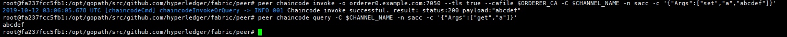
