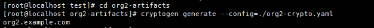
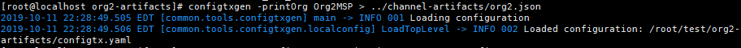
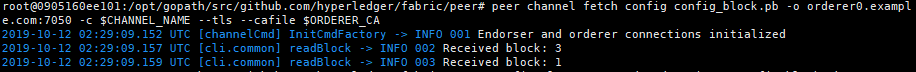
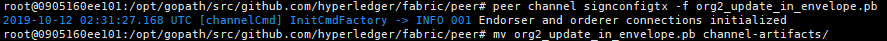
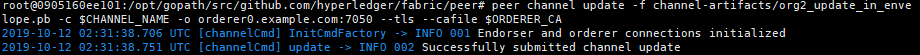
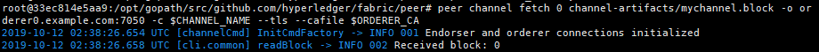
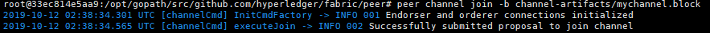
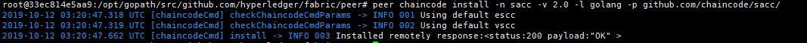
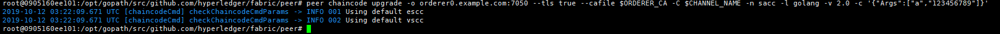
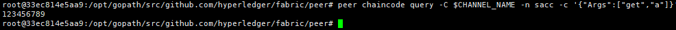

# Fabric 增加 org

*   生成证书

    \[192.168.5.31]

    ```bash
    cd org2-artifacts
    cryptogen generate --config=./org2-crypto.yaml
    ```

    
*   生成 org2 配置文件

    \[192.168.5.31]

    ```bash
    export FABRIC_CFG_PATH=$PWD
    configtxgen -printOrg Org2MSP > ../channel-artifacts/org2.json
    ```

    
*   拷贝证书文件

    \[192.168.5.31]

    ```bash
    cp -r crypto-config/peerOrganizations ../crypto-config/
    ```
*   登录 cli 终端并配置证书和通道环境变量

    \[192.168.5.31]

    ```bash
    docker exec -it cli bash
    export ORDERER_CA=/opt/gopath/src/github.com/hyperledger/fabric/peer/crypto/ordererOrganizations/example.com/orderers/orderer0.example.com/msp/tlscacerts/tlsca.example.com-cert.pem
    export CHANNEL_NAME=mychannel
    ```
*   提取当前通道配置到`config_block.pb`

    \[192.168.5.31]

    ```bash
    peer channel fetch config config_block.pb -o orderer0.example.com:7050 -c $CHANNEL_NAME --tls --cafile $ORDERER_CA
    ```

    
*   将`config_block.pb`转换为`json`格式文件`config.json`

    \[192.168.5.31]

    ```bash
    configtxlator proto_decode --input config_block.pb --type common.Block | jq .data.data[0].payload.data.config > config.json
    ```
*   将`config.json`和`org2.json`组合并输出到`modified_config.json`

    \[192.168.5.31]

    ```bash
    jq -s '.[0] * {"channel_group":{"groups":{"Application":{"groups": {"Org2MSP":.[1]}}}}}' config.json ./channel-artifacts/org2.json > modified_config.json
    ```
*   将`config.json`转化为`config.pb`

    \[192.168.5.31]

    ```bash
    configtxlator proto_encode --input config.json --type common.Config --output config.pb
    ```
*   将`modified_config.json`转换为`modified_config.pb`

    \[192.168.5.31]

    ```bash
    configtxlator proto_encode --input modified_config.json --type common.Config --output modified_config.pb
    ```
*   对比`config.pb`与`modified_config.pb`差异，并输出到`org2_update.pb`

    \[192.168.5.31]

    ```bash
    configtxlator compute_update --channel_id $CHANNEL_NAME --original config.pb --updated modified_config.pb --output org2_update.pb
    ```
*   将`org2_update.pb`转换为`org2_update.json`

    \[192.168.5.31]

    ```bash
    configtxlator proto_decode --input org2_update.pb --type common.ConfigUpdate | jq . > org2_update.json
    ```
*   `org2_update.json`添加标头字段,并输出到`org2_update_in_envelope.json`

    \[192.168.5.31]

    ```bash
    echo '{"payload":{"header":{"channel_header":{"channel_id":"mychannel", "type":2}},"data":{"config_update":'$(cat org2_update.json)'}}}' | jq . > org2_update_in_envelope.json
    ```
*   `org2_update_in_envelope.json`转换为`org2_update_in_envelope.pb`

    \[192.168.5.31]

    ```bash
    configtxlator proto_encode --input org2_update_in_envelope.json --type common.Envelope --output org2_update_in_envelope.pb
    ```
*   配置签名

    \[192.168.5.31]

    ```bash
    peer channel signconfigtx -f org2_update_in_envelope.pb
    mv org2_update_in_envelope.pb channel-artifacts/
    ```

    
* 拷贝`channel-artifacts/org2_update_in_envelope.pb`文件到其它 org 节点相同目录
*   其它节点更新通道

    ```bash
    peer channel update -f channel-artifacts/org2_update_in_envelope.pb -c $CHANNEL_NAME -o orderer0.example.com:7050 --tls --cafile $ORDERER_CA
    ```

    
*   启动 org2 peer0

    \[192.168.5.34]

    ```bash
    docker-compose -f docker-compose-org2-peer0.yaml up -d
    ```
*   登录 cli 终端并配置环境变量

    \[192.168.5.34]

    ```bash
    docker exec -it cli bash
    export ORDERER_CA=/opt/gopath/src/github.com/hyperledger/fabric/peer/crypto/ordererOrganizations/example.com/orderers/orderer0.example.com/msp/tlscacerts/tlsca.example.com-cert.pem
    export CHANNEL_NAME=mychannel
    ```
*   检索区块

    \[192.168.5.34]

    ```bash
    peer channel fetch 0 channel-artifacts/mychannel.block -o orderer0.example.com:7050 -c $CHANNEL_NAME --tls --cafile $ORDERER_CA
    ```

    
*   加入通道

    \[192.168.5.34]

    ```bash
    peer channel join -b channel-artifacts/mychannel.block
    ```

    
*   升级链码

    \[all]

    ```bash
    peer chaincode install -n sacc -v 2.0 -l golang -p github.com/chaincode/sacc/
    ```

    
*   更新链码数据

    \[192.168.5.31]

    ```bash
    peer chaincode upgrade -o orderer0.example.com:7050 --tls true --cafile $ORDERER_CA -C $CHANNEL_NAME -n sacc -l golang -v 2.0 -c '{"Args":["a","123456789"]}'
    ```

    
*   查询数据

    ```bash
    peer chaincode query -C $CHANNEL_NAME -n sacc -c '{"Args":["get","a"]}'
    ```

    
*   修改数据

    ```bash
    peer chaincode invoke -o orderer0.example.com:7050 --tls true --cafile $ORDERER_CA -C $CHANNEL_NAME -n sacc -c '{"Args":["set","a","123456"]}'
    ```
