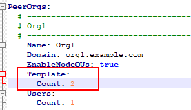
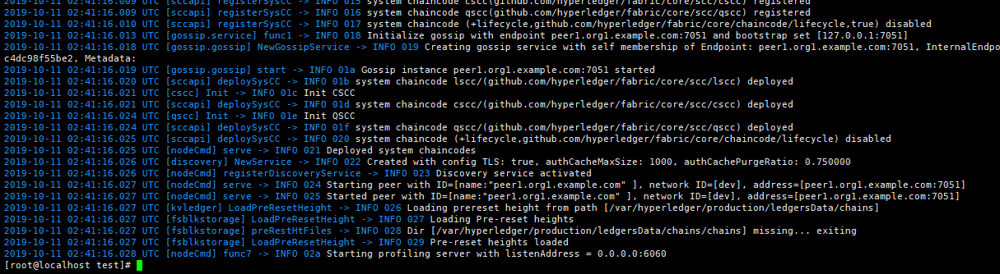
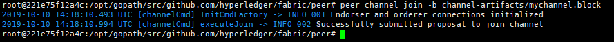
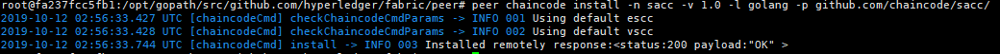
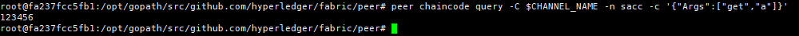

# Fabric 增加 peer

- 修改`crypto-config.yaml`文件，加大`Template`数

  

- 扩展证书数量

  ```bash
  cryptogen extend --config=./crypto-config.yaml
  ```

- 启动 peer 服务

  ```bash
  docker-compose -f docker-compose-org1-peer1.yaml up -d
  ```

- 查看 peer 日志

  ```bash
  docker logs peer1.org1.example.com
  ```

  

- 登录 cli 终端

  ```bash
  docker exec -it cli bash
  ```

- 配置 orderer 证书和通道环境变量

  ```bash
  export ORDERER_CA=/opt/gopath/src/github.com/hyperledger/fabric/peer/crypto/ordererOrganizations/example.com/orderers/orderer0.example.com/msp/tlscacerts/tlsca.example.com-cert.pem
  export CHANNEL_NAME=mychannel
  ```

- 加入通道

  ```bash
  peer channel join -b channel-artifacts/mychannel.block
  ```

  

- 安装链码

  ```bash
  peer chaincode install -n sacc -v 1.0 -l golang -p github.com/chaincode/sacc/
  ```

  

- 查询数据

  ```bash
  peer chaincode query -C $CHANNEL_NAME -n sacc -c '{"Args":["get","a"]}'
  ```

  
