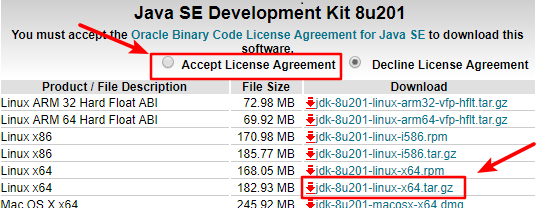

# CentOS7 安装 JDK

- 打开浏览器，访问[下载页面](https://www.oracle.com/technetwork/java/javase/downloads/jdk8-downloads-2133151.html)，点击根据系统环境选择对应的下载包。
  

- 将文件上传 centos7 系统，并解压至`/opt`目录下

  ```bash
  tar xvf jdk-8u201-linux-x64.tar.gz -C /opt
  ls -l /opt
  ```

  

- 编辑 `/etc/profile`文件，在文件尾部添加以下内容

  ```properties
  #java environment
  export JAVA_HOME=/opt/jdk1.8.0_201
  export CLASSPATH=.:${JAVA_HOME}/jre/lib/rt.jar:${JAVA_HOME}/lib/dt.jar:${JAVA_HOME}/lib/tools.jar
  export PATH=$PATH:${JAVA_HOME}/bin
  ```

- 加载`/etc/profile`文件，并验证是否安装成功。

  ```bash
  source /etc/profile
  java -version
  ```

  
