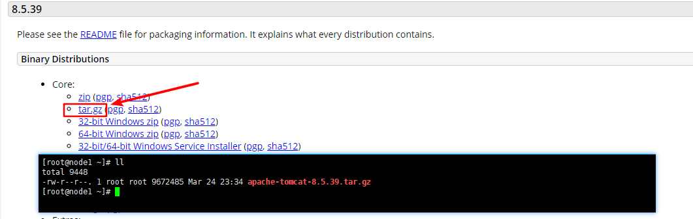

# CentOS7 安装 Tomcat8

*   安装依赖

    ```bash
    yum install -y rng-tools gcc-c++
    systemctl restart rngd.service
    systemctl enable rngd.service
    ```

    > Tocmat 的 Session ID 是通过 SHA1 算法计算得到的，计算 Session ID 的时候必须有一个密钥。为了提高安全性 Tomcat 在启动的时候回通过随机生成一个密钥。需要判断是否有足够的熵(`cat /proc/sys/kernel/random/entropy_avail`)来用于产生随机数。生成随机数的速度慢会导致 tomcat 缓慢。最小化安装系统的时候，是没有`rng-tools`这个包的，通过运行`rngd.service`可以加大熵，提供产生随机数的速度，提高 tomcat 的速度。
*   访问 Tomcat 官网，[下载 Tomcat8](https://tomcat.apache.org/download-80.cgi)安装包,并上传系统。

    
*   解压安装包到`/opt`目录。

    ```bash
    tar -xvf apache-tomcat-8.5.39.tar.gz -C /opt/
    ```
*   配置`Tomcat`相关环境变量。

    编辑`/opt/apache-tomcat-8.5.39/bin/setenv.sh`文件，配置以下内容。

    ```properties
    JAVA_HOME=/opt/jdk1.8.0_201
    JRE_HOME=/opt/jdk1.8.0_201/jre
    CATALINA_PID=/opt/apache-tomcat-8.5.39/tomcat.pid
    SERVICE_START_WAIT_TIME=90
    # 因为daemon默认的启动时间是90秒，而jsvc默认是10秒，正式项目，大部分的war包都不可能在10秒内运行起来的，导致了，一直返回Service exit with a return value of 143
    JAVA_OPTS="-server -Xms128M -Xmx256M"
    # -Xms：Java虚拟机堆区内存初始内存分配的大小
    # -Xmx：Java虚拟机堆区内存可被分配的最大上限
    # -XX:newSize:新生代初始化内存的大小(注意：该值需要小于-Xms的值)。
    # -XX:MaxnewSize:新生代可被分配的内存的最大上限(注意：该值需要小于-Xmx的值)。
    # -XX:PermSize:非堆区初始化内存分配大小。
    # -XX:MaxPermSize:非堆区分配的内存的最大上限。
    ```
*   编译`jsvc` 以 `daemon`模式启动 Tomcat。

    ```bash
    cd /opt/apache-tomcat-8.5.39/bin/
    tar xvf commons-daemon-native.tar.gz
    cd commons-daemon-1.1.0-native-src/unix/
    ./configure
    make
    cp jsvc ../..
    ```
*   添加`tomcat`用户,\` 并修改安装目录所有者。

    ```bash
    useradd tomcat -s /sbin/nologin -M
    chown -R tomcat:tomcat /opt/apache-tomcat-8.5.39
    ```
*   注册服务

    编辑`/usr/lib/systemd/system/tomcat.service`文件，配置以下内容。

    ```properties
    [Unit]
    Description=tomcat
    After=network.target
    [Service]
    Type=forking
    PIDFile=/opt/apache-tomcat-8.5.39/tomcat.pid
    ExecStart=/opt/apache-tomcat-8.5.39/bin/daemon.sh start
    ExecStop=/opt/apache-tomcat-8.5.39/bin/daemon.sh stop
    Group=tomcat
    User=tomcat
    PrivateTmp=true
    [Install]
    WantedBy=multi-user.target
    ```
*   启动 Tomcat 并查看运行状态。

    ```bash
    systemctl daemon-reload
    systemctl start tomcat.service
    systemctl status tomcat.service
    ```
