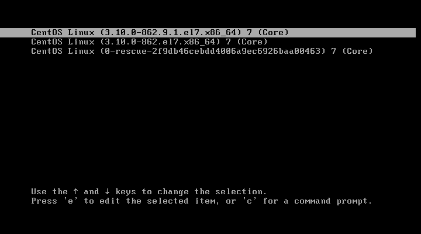
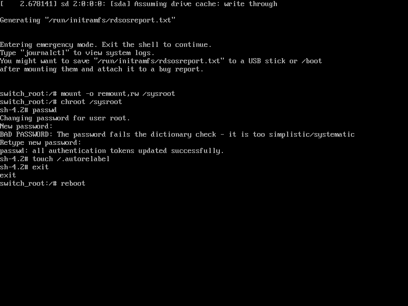

# Centos7重置密码

在开机引导界面输入`e`编辑开机引导项，在Linux16一行末尾添加 rd.break，按快捷键Ctrl+X,用户修改后的引导项启动电脑.




开机后输入如下命令进行密码修改

```bash
mount -o remount,rw /sysroot
chroot /sysroot
passwd
touch /.autorelabel
exit
rebas
```


