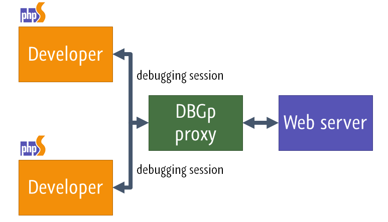
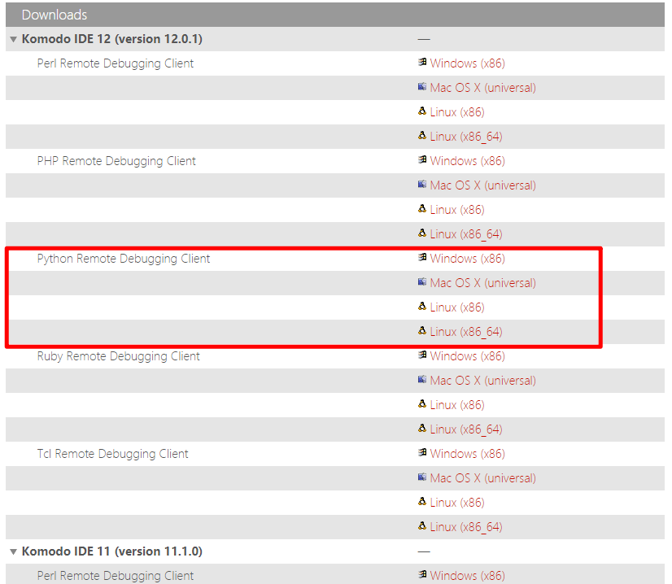
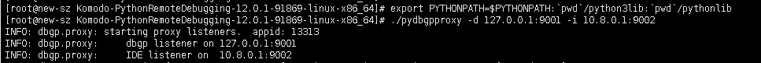
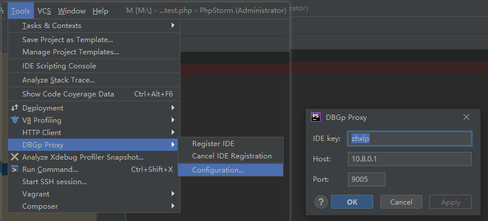
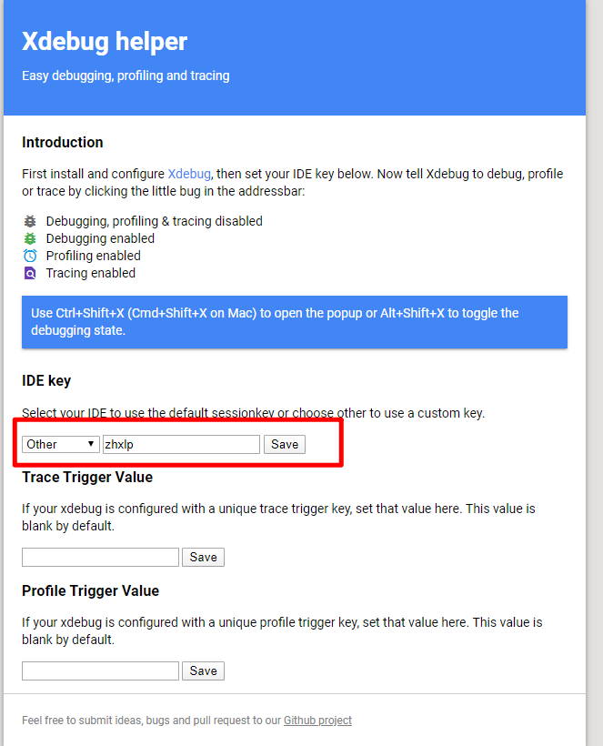

# PHP Xdebug

参考连接：https://www.jetbrains.com/help/phpstorm/multiuser-debugging-via-xdebug-proxies.html



## Xdebug

*   设置 xdebug 配置

    修改`/etc/php.d/15-xdebug.ini`

    ```properties
    zend_extension=xdebug.so
    xdebug.remote_enable = on
    xdebug.remote_handler = dbgp
    xdebug.remote_host = 127.0.0.1
    xdebug.remote_port = 9001

    ```

## DBGp 代理

*   从 Komodo 的[下载页面](http://code.activestate.com/komodo/remotedebugging/)中，我们可以找到适用于我们平台的 DBGp 代理的 Python 二进制文件

    
*   运行 DBGp 代理

    在 Web 服务器上或在可以与 Web 服务器和所有开发人员计算机进行通信的计算机上启动 DBGp 代理。DBGp 代理可执行文件接受两个参数：`-d`和`-i`。

    参数定义了从 Web 服务器监听调试器连接的 IP 地址和端口，以及监听开发人员的 IP 地址和端口。

    例如，监听环回地址（`127.0.0.1` ）和端口`9001上的调试器连接，并监计算机IP地址和端口`9002\`上的开发人员。

    ```bash
    export PYTHONPATH=$PYTHONPATH:`pwd`/python3lib:`pwd`/pythonlib
    ./pydbgpproxy -d 127.0.0.1:9001 -i 0.0.0.0:9005
    ```

    

## PhpStorm配置




## VSCODE 配置

编辑 `launch.json`

```json
{
  "version": "0.2.0",
  "configurations": [
    {
      "name": "Listen for DBGp Proxy",
      "type": "php",
      "request": "launch",
      "pathMappings": {
        "/data/www/test": "${workspaceFolder}"
      },
      "proxy": {
        "enable": true,
        "host": "10.8.0.1",
        "port": 9005,
        "key": "zhxlp"
      }
    }
  ]
```

## 配置浏览器

### 方法一

使用xdebug插件



方法二

使用url参数 `?XDEBUG_SESSION_START=zhxlp`
