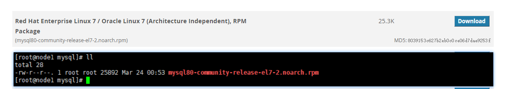
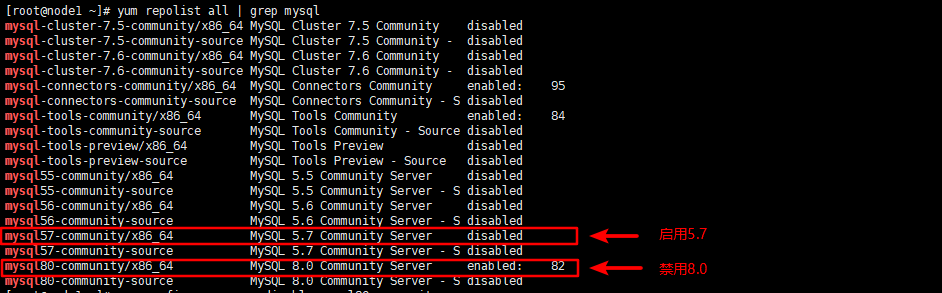
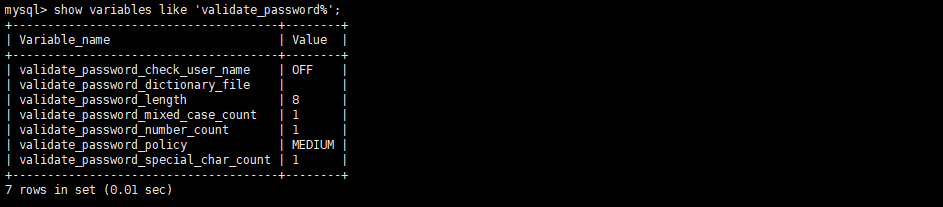

# CentOS7 Install MySQL5.7

*   访问[mysql 官网](https://dev.mysql.com/downloads/repo/yum/)下载系统对应的 rpm 包,并上传系统。

    
*   安装 mysql 源仓库包。

    ```bash
    rpm -ivh mysql80-community-release-el7-2.noarch.rpm
    ```
*   查看 mysql 源仓库列表，禁用当前版本仓库，选择 5.7 版本,并确认开启的版本。

    > `yum-config-manager`命令需要安装`yum-utils`包。`yum install -y yum-utils`
    >
    > 或者手动编辑`/etc/yum.repos.d/mysql-community.repo` 文件

    ```bash
    yum repolist all | grep mysql
    yum-config-manager --disable mysql80-community
    yum-config-manager --enable mysql57-community
    yum repolist enabled | grep mysql
    ```

    

    
*   安装 MySQL

    ```bash
    yum install -y mysql-community-server
    ```
*   配置数据库忽略大小写

    编辑`/etc/my.cnf`,在\[mysqld]部分添加`lower_case_table_names=1`
*   启动 MySQL 服务并查看服务运行状态

    ```bash
    systemctl start mysqld.service
    systemctl status mysqld.service
    ```
*   查看 root 密码

    > 从 MySQL 5.7 开始，MySQL 服务器初始化，将`'root'@'localhost'` 创建一个超级用户帐户并把密码写入到日志中。

    ```bash
    grep 'temporary password' /var/log/mysqld.log
    ```

    
*   登录 mysql 并修改密码

    > 默认密码策略：至少 8 位，必须包含大小写字母、数字、特殊字符。

    ```bash
    mysql -uroot -p
    ALTER USER 'root'@'localhost' IDENTIFIED BY 'MyNewPass4!';
    ```
*   创建远程 root 管理员用户

    ```sql
    GRANT ALL PRIVILEGES ON *.* TO 'root'@'%' IDENTIFIED BY 'MyNewPass4!' WITH GRANT OPTION ;
    FLUSH PRIVILEGES ;
    ```
* 修改密码安全策略
  *   查看当前策略

      ```sql
      show variables like 'validate_password%';
      ```

      
  *   字段说明

      | 字段                                       | 说明        |
      | ---------------------------------------- | --------- |
      | validate\_password\_policy               | 策略等级      |
      | validate\_password\_length               | 密码最短长度    |
      | validate\_password\_mixed\_case\_count   | 大小写字母至少个数 |
      | validate\_password\_number\_count        | 数字至少个数    |
      | validate\_password\_special\_char\_count | 特殊字符至少个数  |

      | 策略          | 检查规则                  |
      | ----------- | --------------------- |
      | 0 or LOW    | 长度                    |
      | 1 or MEDIUM | 长度、数字、大小写字母、特殊字符      |
      | 2 or STRONG | 长度、数字、大小写字母、特殊字符、密码字典 |
  *   修改

      ```sql
      -- 修改策略等级
      set global validate_password_policy=0;
      -- 修改密码长度
      set global validate_password_length=0;
      ```
