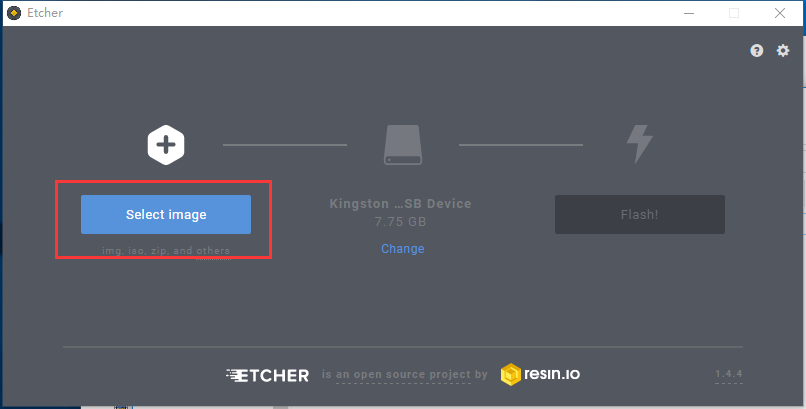
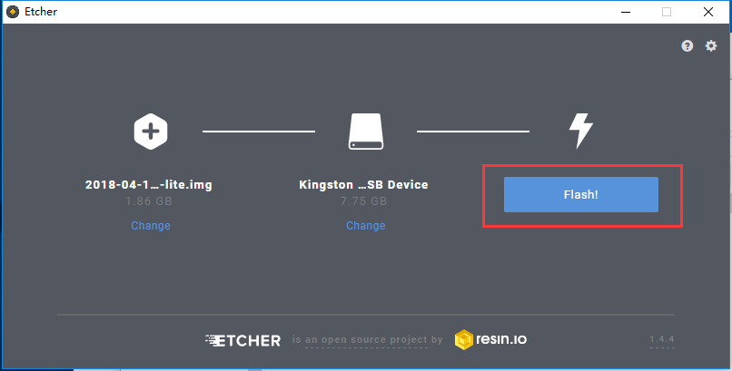
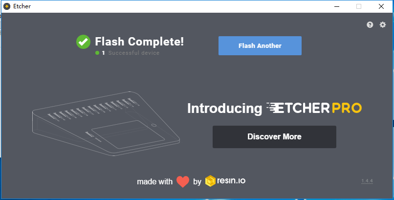
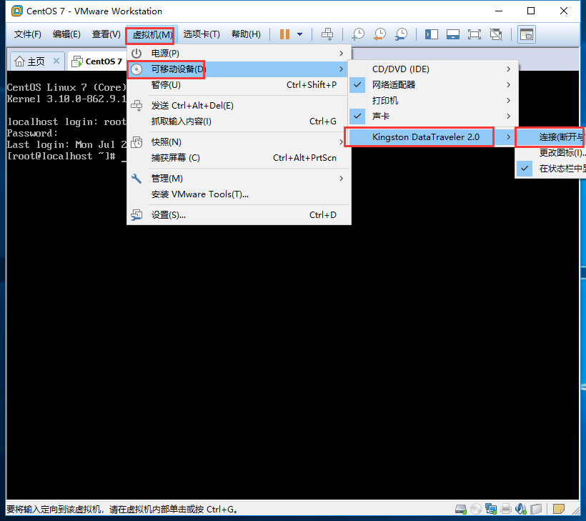
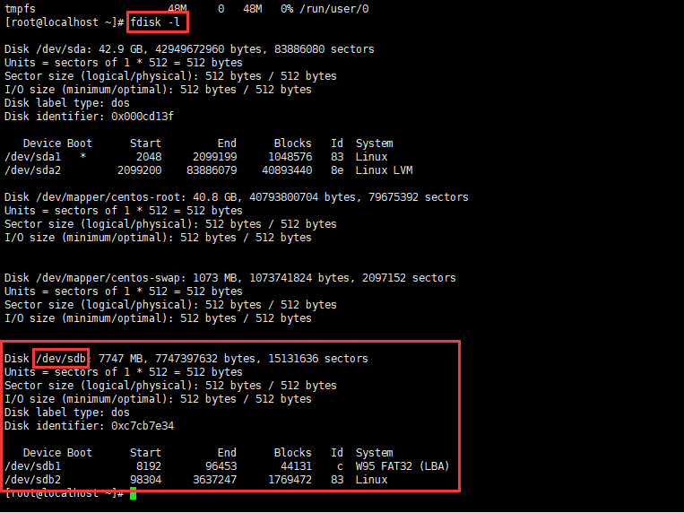
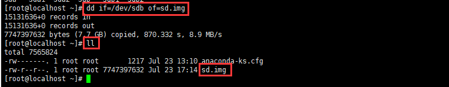
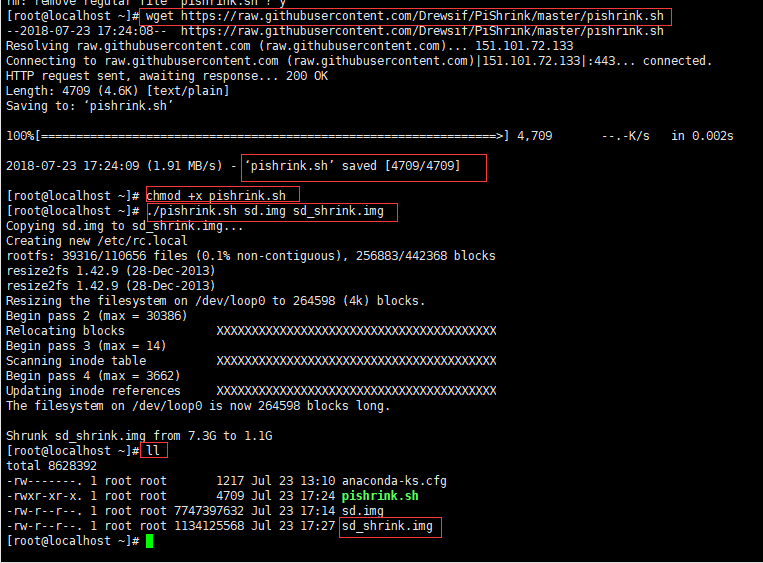

# 树莓派系统烧录及系统打包制作

## 烧录 SD 卡

### 工具

[Etcher](https://etcher.io/)

SD 卡

读卡器

### 步骤

将 SD 卡放入读卡器，插入到电脑上，打开 Etcher 软件。

点击 Select Image 选择要烧录的系统镜像文件。



点击 Select Drive 选择烧录设备。


点击 Flash 进行烧录。



等待烧录完成。


烧录完成，移除读卡器。



## 镜像打包

### 工具

Linux 电脑或者 Linux 虚拟机

压缩脚本[PiShrink](https://github.com/Drewsif/PiShrink/blob/master/pishrink.sh)

### 步骤

将带打包的镜像的 SD 卡放入读卡器，插入 Linux 电脑或虚拟机，虚拟机连接 SD 卡。



查看 SD 卡位置，为下一步复制 SD 卡提供参数。

```bash
fdisk -l
```



复制 SD 卡。

```bash
# dd if=复制对象 of=输出对象
dd if=/dev/sdb of=sd.img
```



下载压缩脚本进行压缩。

```bash
# 下载PiShrink.sh脚本
wget https://raw.githubusercontent.com/Drewsif/PiShrink/master/pishrink.sh
# 给脚本添加执行权限
chmod +x pishrink.sh
# 执行脚本 sd.img为复制的sd卡文件名，sd_shrink.img 为压缩后的文件名
./pishrink.sh sd.img sd_shrink.img
```



sd_shrink.img 为打包后的镜像问题，通过进行烧录工具可以直接烧录到 SD 卡。
