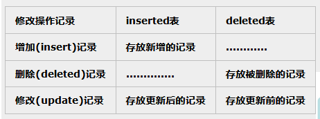
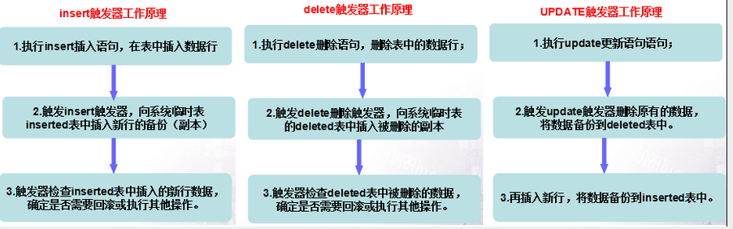
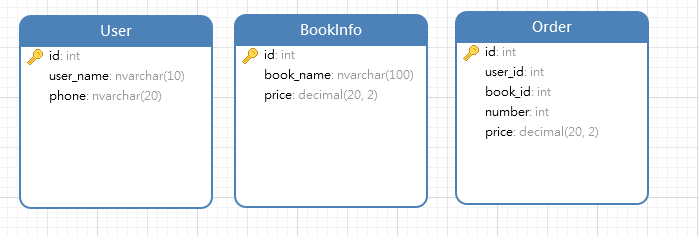
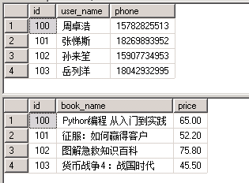

# SQL Server Trigger

## 语法

*   创建或修改触发器

    ```sql
    -- 表或视图的INSERT、UPDATE或DELETE语句的触发器（DML触发器）

    { CREATE | ALTER } TRIGGER [ schema_name . ]trigger_name
    -- schema_name: DML 触发器所属架构的名称,一般不使用
    -- trigger_name: 触发器的名称。 一般由字母、数字、下划线构成,长度128字符以内
    ON { table | view }
    -- table: 表触发器,填写数据库表名
    -- view: 视图触发器,填写视图名
    [ WITH <dml_trigger_option> [ ,...n ] ]
    -- dml_trigger_option: 触发器高级选项,例:ENCRYPTION,加密触发器语句
    { FOR | AFTER | INSTEAD OF }
    -- FOR: 后触发,仅当触发 SQL 语句中指定的所有操作都已成功启动时，DML 触发器才触发。 所有引用级联操作和约束检查也必须在此触发器触发前成功启动。
    -- AFTER: 与FOR同义,但无法对视图定义 AFTER 触发器
    -- INSTEAD OF: 替代触发器,用来代替通常的触发动作,系统不是直接对表执行这些操作,而是把操作内容交给触发器,因为INSTEAD OF 触发器的动作要早于表的约束处理。每个INSERT、UPDATE 或 DELETE 语句只能有一个 INSTEAD OF 触发器
    { [ INSERT ] [ , ] [ UPDATE ] [ , ] [ DELETE ] }
    -- INSERT: 插入时触发
    -- UPDATE: 更新时触发
    -- DELETE: 删除时触发
    [ WITH APPEND ]
    [ NOT FOR REPLICATION ]
    -- NOT FOR REPLICATION: 当复制进程更改触发器所涉及的表时,不要执行该触发器
    AS
    -- 触发语句,触发器可以包含任意数量和类型的 Transact-SQL 语句
    ```
*   禁用触发器

    ```sql
    ALTER TABLE tabla_name DISABLE TRIGGER trigger_name
    -- tabla_name: 数据库表名
    -- trigger_name: 触发器名
    ```
*   删除触发器

    ```sql
    DROP TRIGGER trigger_name
    -- trigger_name: 触发器名
    ```

## INSERTED 表和 DELETED 表

Deleted 表用于存储 DELETE 和 UPDATE 语句所影响的行的复本。在执行 DELETE 或 UPDATE 语句时，行从触发器表中删除，并传输到 deleted 表中。Deleted 表和触发器表通常没有相同的行。

Inserted 表用于存储 INSERT 和 UPDATE 语句所影响的行的副本。在一个插入或更新事务处理中，新建行被同时添加到 inserted 表和触发器表中。Inserted 表中的行是触发器表中新行的副本。



SQL Server 触发器有三种执行时机：After、For、Instead of

Instead Of 触发器与 For 和 After 触发器的工作流程是不一样。

For 和 After 触发器是在 SQLSERVER 服务器接到执行 SQL 语句请求之后，先建立 Inserted 和 Updated 临时表，然后在更改物理表上的数据，最后才激活触发器程序。

Instead Of 触发器在 SQLSERVER 服务器接到执行 SQL 语句请求，建立 Inserted 和 Updated 临时表后就激活了 Instead Of 触发器程序，至于 SQL 语句的请求如何操作数据就不在管了，把执行权全权叫给了 Instead Of 触发器。

For 和 After 触发器工作流程图



## 示例

| 用户表(User)  |         |
| ---------- | ------- |
| id         | 用户编号,主键 |
| user\_name | 用户名     |
| phone      | 电话      |

| 书籍信息(BookInfo) |         |
| -------------- | ------- |
| id             | 书籍编号,主键 |
| book\_name     | 书籍名     |
| price          | 单价      |

| 订单(Order) |         |
| --------- | ------- |
| id        | 订单编号,主键 |
| user\_id  | 用户ID    |
| book\_id  | 书籍ID    |
| number    | 数量      |
| price     | 总价      |



```sql
-- 创建表
IF EXISTS(SELECT Name FROM Sysobjects WHERE Name = 'User')
DROP TABLE [User]
GO

CREATE TABLE [User](
[id] int IDENTITY(100,1) PRIMARY KEY ,
[user_name] nvarchar(10) not null,
[phone] nvarchar(20)
)

IF EXISTS(SELECT Name FROM Sysobjects WHERE Name = 'BookInfo')
DROP TABLE [BookInfo]
GO

CREATE TABLE [BookInfo](
[id] int IDENTITY(100,1) PRIMARY KEY ,
[book_name] nvarchar(100) not null,
[price] decimal(20,2) not null
)

IF EXISTS(SELECT Name FROM Sysobjects WHERE Name = 'Order')
DROP TABLE [Order]
GO

CREATE TABLE [Order](
[id] int IDENTITY(100,1) PRIMARY KEY ,
[user_id] int not null,
[book_id] int not null,
[number] int not null,
[price] decimal(20,2)
)
-- 添加初始化语句
SET IDENTITY_INSERT [User] ON
INSERT INTO [User]([id],[user_name],[phone]) VALUES(100,'周卓浩','15782825513'),(101,'张悌斯','18269893952'),(102,'孙来笙','15907734953'),(103,'岳列洋','18042932995')
SET IDENTITY_INSERT [User] OFF

SET IDENTITY_INSERT [BookInfo] ON
INSERT INTO [BookInfo]([id],[book_name],[price]) VALUES(100,'Python编程 从入门到实践','65.00'),(101,'征服：如何赢得客户','52.20'),(102,'图解急救知识百科','75.80'),(103,'货币战争4 ：战国时代','45.50')
SET IDENTITY_INSERT [BookInfo] OFF

-- 查询订单信息
SELECT
	[Order].[id] '订单ID',
	[User].[user_name] '用户名',
	[BookInfo].[book_name] '书籍名称',
	[BookInfo].[price] '单价',
	[Order].[number] '数量',
  [Order].[price] '总价'
FROM
	[Order]
	LEFT JOIN [User] ON [Order].[user_id] = [User].[id]
	LEFT JOIN [BookInfo] ON [Order].[book_id] = [BookInfo].[id]
```



*   在 Order 表创建触发器`update_order_price_trigger`,用于计算正确总价

    **尽量不要使用游标,游标性能差**

    例 1：使用游标

    ```sql
    CREATE TRIGGER update_order_price_trigger ON [Order]
    FOR INSERT,UPDATE
    AS
    BEGIN
      DECLARE @id1 INT
      -- 定义游标
    DECLARE cursor1 CURSOR FOR
        SELECT [id] FROM [inserted]
      -- 打开游标
      OPEN cursor1
      -- 获取第一行数据
      FETCH NEXT  FROM cursor1 INTO @id1
      -- 通过判断@@FETCH_STATUS进行循环
      WHILE @@FETCH_STATUS = 0
      BEGIN
        UPDATE [Order]
    		SET [Order].[price] = [Order].[number] * [BookInfo].[Price]
        FROM [Order]
        LEFT JOIN [BookInfo] ON [Order].[book_id] = [BookInfo].[id]
        WHERE [Order].[id] =@id1
    		-- 获取下一行数据
        FETCH NEXT FROM cursor1 INTO @id1
      END
      CLOSE cursor1
      DEALLOCATE cursor1
    END
    ```

    例 2:不使用游标

    ```sql
    CREATE TRIGGER update_order_price_trigger ON [Order]
    FOR INSERT,UPDATE
    AS
    BEGIN
      UPDATE [Order] SET [Order].[price] = [Order].[number] * [BookInfo].[Price]
      FROM [inserted]
    	LEFT JOIN [Order] ON [inserted].[id] = [Order].[id]
    	LEFT JOIN [BookInfo] ON [Order].[book_id] = [BookInfo].[id]
    END
    ```
