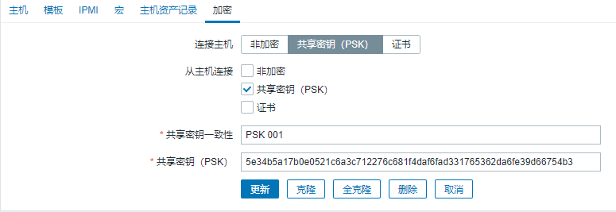

# Zabbix 加密连接

- 生成 PSK 文件

  ```bash
  openssl rand -hex 32 | tee /etc/zabbix/zabbix_agentd.psk
  # 5e34b5a17b0e0521c6a3c712276c681f4daf6fad331765362da6fe39d66754b3
  ```

- 配置`zabbix_agentd.conf`

  修改配置文件中的一下值

  ```properties
  TLSConnect=psk
  TLSAccept=psk
  TLSPSKFile=/home/zabbix/zabbix_agentd.psk
  TLSPSKIdentity=PSK 001
  ```

- Zabbix 前端配置 PSK 加密

  【配置】【主机】【点击主机名】【加密】

  

  > **连接主机**：server 连接 agent
  >
  > **从主机连接**：agent 连接 server
  >
  > **共享密钥一致性**：zabbix_agentd.conf 中 TLSPKIdentity 值
  >
  > **共享密钥(PSK)**：zabbix_agentd.conf 中 TLSPSKFile 指定文件的内容
