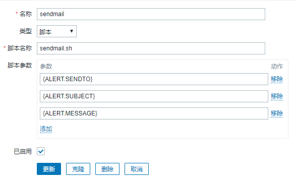
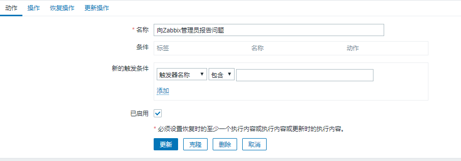
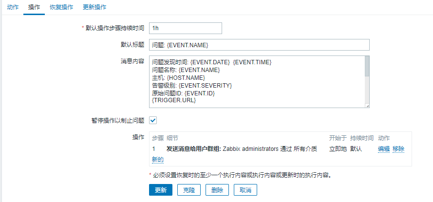
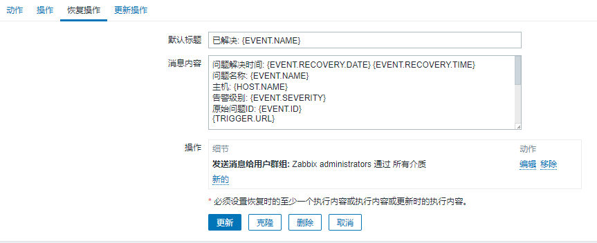
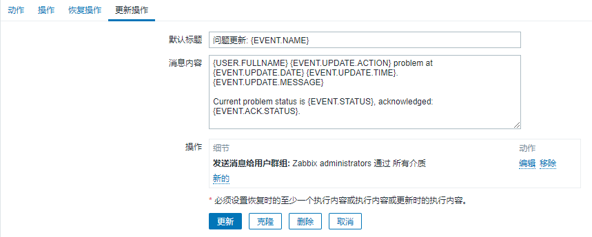

# Zabbix 配置邮件报警

*   服务器安装配置 mailx 发生邮件

    参考之前文档安装配置 mailx 发送邮件
*   创建邮件发送脚本

    创建`/usr/lib/zabbix/alertscripts/sendmail.sh`文件,内容如下

    ```properties
    #!/bin/bash
    #send mail
    subject=`echo $2 | tr '\r' ' '`
    echo $3 | tr '\r' '\n' | mail -s "${subject}" $1
    ```
*   脚本添加执行权限

    ```bash
    chmod +x /usr/lib/zabbix/alertscripts/sendmail.sh
    ```
*   定义邮件脚本报警媒介

    【管理】【报警媒介类型】【创建报警媒介】【更新】

    

    > {ALERT.SENDTO} #收件人地址
    >
    > {ALERT.SUBJECT} #邮件主题
    >
    > {ALERT.MESSAGE} #邮件内容
*   用户设置报警媒介

    【管理】【用户】【点击用户名】【报警媒介】【添加】【更新】

    
*   定义触发动作

    【配置】【动作】【创建动作】

    *   动作

        
    *   操作

        

        ```properties
        问题: {EVENT.NAME}

        问题发现时间: {EVENT.DATE}  {EVENT.TIME}
        问题名称: {EVENT.NAME}
        主机: {HOST.NAME}
        告警级别: {EVENT.SEVERITY}
        原始问题ID: {EVENT.ID}
        {ITEM.NAME}：{ITEM.VALUE}
        问题链接：{TRIGGER.URL}
        问题备注:
        {TRIGGER.DESCRIPTION}

        ----------------------
        告警级别定义:
          Not classified:未分类;
          Information:信息;
          Warning:警告;
          Average:一般严重;
          High:严重;
          Disaster:灾难
        ```
    *   恢复操作

        

        ```properties
        已解决: {EVENT.NAME}

        问题解决时间: {EVENT.RECOVERY.DATE} {EVENT.RECOVERY.TIME}
        问题名称: {EVENT.NAME}
        主机: {HOST.NAME}
        告警级别: {EVENT.SEVERITY}
        原始问题ID: {EVENT.ID}
        {ITEM.NAME}：{ITEM.VALUE}
        问题链接：{TRIGGER.URL}
        问题备注:
        {TRIGGER.DESCRIPTION}

        ----------------------
        告警级别定义:
          Not classified:未分类;
          Information:信息;
          Warning:警告;
          Average:一般严重;
          High:严重;
          Disaster:灾难
        ```
    *   更新

        
*   创建触发器

    省略

​
